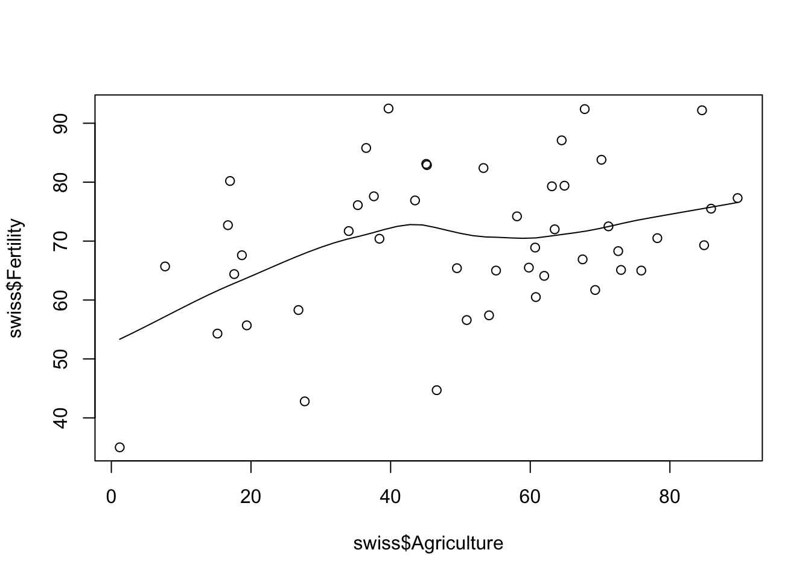
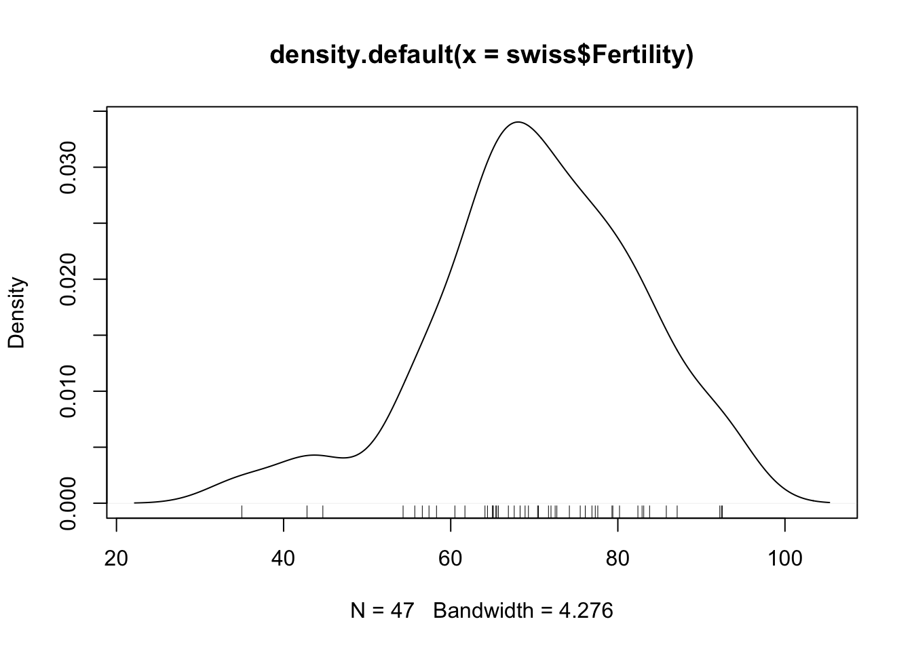

---
output:
  html_document: default
  pdf_document: default
---

# (PART) R Tutorials {-} 

# R Basics {#intro}

Before we begin, make sure you have [R](https://cran.r-project.org/) and 
[RStudio](https://www.rstudio.com/products/rstudio/download3/#download) installed.

## R Markdown

Throughout this course, [R Markdown](http://rmarkdown.rstudio.com/lesson-1.html) will make our lives easier. Make sure that the `rmarkdown` library is installed:

```
install.packages("rmarkdown")
```

For each assignment, you will create an R Markdown file (*.Rmd) and submit that file by the following class session using [classroom.google.com](https://classroom.google.com). Each class
has been made using R Markdown, so you can find many examples by going to the GitHub repository
for this course [github.com/jonpage/r-course](https://github.com/jonpage/r-course)

## Working with data already loaded into R

Base R comes with a set of sample data that is useful for illustrating techniques in R.
Run the following command to see a list of the datasets in the core library `datasets`:

```
library(help = "datasets")
```

These datasets are accessible automatically. We'll start with the Swiss Fertility and Socioeconomic Inicators (1888) dataset. See a description of the dataset by using the help command, either `?swiss` or `help(swiss)`. This dataset is technically a `data.frame`, which you can see by using the command `class(swiss)`. For more information on `data.frame`s take a look at the documentation(`help(data.frame)`)

### Numeric summaries

Here are a few ways we can summarize a dataset:

`head()` shows us the first six rows of a `data.frame`.

```r
head(swiss)
```

```
##              Fertility Agriculture Examination Education Catholic
## Courtelary        80.2        17.0          15        12     9.96
## Delemont          83.1        45.1           6         9    84.84
## Franches-Mnt      92.5        39.7           5         5    93.40
## Moutier           85.8        36.5          12         7    33.77
## Neuveville        76.9        43.5          17        15     5.16
## Porrentruy        76.1        35.3           9         7    90.57
##              Infant.Mortality
## Courtelary               22.2
## Delemont                 22.2
## Franches-Mnt             20.2
## Moutier                  20.3
## Neuveville               20.6
## Porrentruy               26.6
```

`summary()` provides summary statistics for each column in a `data.frame`.

```r
summary(swiss)
```

```
##    Fertility      Agriculture     Examination      Education    
##  Min.   :35.00   Min.   : 1.20   Min.   : 3.00   Min.   : 1.00  
##  1st Qu.:64.70   1st Qu.:35.90   1st Qu.:12.00   1st Qu.: 6.00  
##  Median :70.40   Median :54.10   Median :16.00   Median : 8.00  
##  Mean   :70.14   Mean   :50.66   Mean   :16.49   Mean   :10.98  
##  3rd Qu.:78.45   3rd Qu.:67.65   3rd Qu.:22.00   3rd Qu.:12.00  
##  Max.   :92.50   Max.   :89.70   Max.   :37.00   Max.   :53.00  
##     Catholic       Infant.Mortality
##  Min.   :  2.150   Min.   :10.80   
##  1st Qu.:  5.195   1st Qu.:18.15   
##  Median : 15.140   Median :20.00   
##  Mean   : 41.144   Mean   :19.94   
##  3rd Qu.: 93.125   3rd Qu.:21.70   
##  Max.   :100.000   Max.   :26.60
```

### Visual summaries

Scatterplot matrix (default plot of a data.frame):
```
plot(swiss)
# or
pairs(swiss)
```


Scatterplot of two dimensions
```
plot(swiss[,c("Education", "Fertility")])
# or
plot(swiss[4,1])
# or
plot(swiss$Education, swiss$Fertility)
# or
plot(swiss$Fertility ~ swiss$Education)
```


Smoothed Scatterplot of two dimensions

```r
smoothScatter(swiss$Fertility ~ swiss$Examination)
```


Scatterplot with a `loess` (locally weighted polynomial regression)

```r
scatter.smooth(swiss$Fertility ~ swiss$Agriculture)
```



### Distribution plots

Histograms:

```r
hist(swiss$Catholic)
```


Stem-and-Leaf Plots:

```r
stem(swiss$Fertility)
```

```
## 
##   The decimal point is 1 digit(s) to the right of the |
## 
##   3 | 5
##   4 | 35
##   5 | 46778
##   6 | 124455556678899
##   7 | 01223346677899
##   8 | 0233467
##   9 | 223
```

Kernel density plot (and add a rug showing where observation occur):

```r
plot(density(swiss$Fertility))
rug(swiss$Fertility)
```



Boxplots:

```r
boxplot(swiss)
```


#### More complicated charts
Conditioning plots:

```r
coplot(swiss$Fertility ~ swiss$Examination | as.factor(swiss$Catholic > 50))
```


Star plots (half-star plots here):

```r
stars(swiss, key.loc = c(15,1), flip.labels = FALSE, full = FALSE)
```


## Assignment

Create a new R Markdown file. 

Choose a dataset from `datasets` (`library(help = "datasets")` will show you a list) and create 5 charts in an R Markdown file from the example charts above. Run the following command to see what else is available in the base R graphics package:

```
demo(graphics)
```
