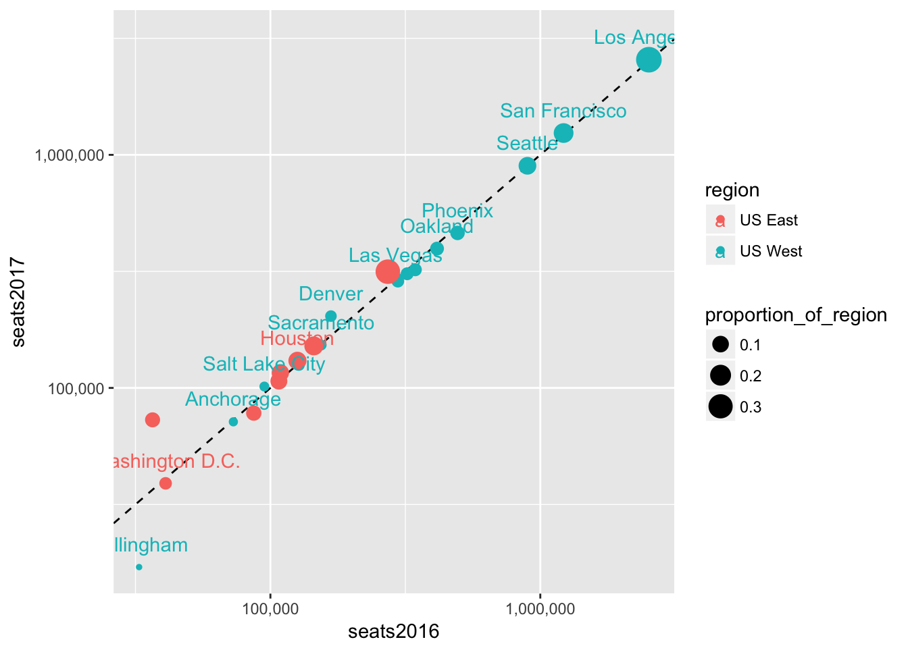

---
output:
  html_document: default
  pdf_document: default
---

# Facets, Bubbles, and Transparency {#facets-and-bubbles}

## Data

For this session, we'll explore the Hawaii Tourism Authority (HTA) [Air Seat Projection](http://www.hawaiitourismauthority.org/research/research/infrastructure-research/).
I'll be working with the 
[Air Seat Projection for 2017 (revised 06/17)](http://www.hawaiitourismauthority.org/default/assets/File/2017%20Air%20Seat%20Forecast%20rev%200617.xls). Feel free to download the latest available.

### Importing non-standard Excel files

The first steps in preparing a non-standard Excel file are (1) identify how many rows to skip
and (2) provide column names if the column names are not neatly contained in a single row. You may
also want to set the `range` if there is metadata at the end of the table you are importing. `range`
overrides any `skip` setting, so we wont have to specify the number of rows to skip.


```r
library(tidyverse)
library(readxl)
```


```r
seats <- read_excel("data/2017 Air Seat Forecast rev 0617.xls", col_names = c(
  "dep_city", 
  "seats2017Q1", "seats2017Q2", "seats2017Q3", "seats2017Q4", "seats2017", 
  "seats2016Q1", "seats2016Q2", "seats2016Q3", "seats2016Q4", "seats2016",
  "seatschangeQ1", "seatschangeQ2", "seatschangeQ3", "seatschangeQ4", "seatschange"
), range = "A5:P78")
seats
```

```
## # A tibble: 74 x 16
##     dep_city seats2017Q1 seats2017Q2 seats2017Q3 seats2017Q4 seats2017
##        <chr>       <dbl>       <dbl>       <dbl>       <dbl>     <dbl>
##  1     TOTAL     2987920     3016376     3168233     3050112  12222641
##  2 SCHEDULED     2966915     2996155     3140998     3029794  12133862
##  3  CHARTERS       21005       20221       27235       20318     88779
##  4      <NA>          NA          NA          NA          NA        NA
##  5  US TOTAL     1996549     2108969     2215424     2071513   8392455
##  6 SCHEDULED     1978616     2091981     2200195     2055171   8325963
##  7  CHARTERS       17933       16988       15229       16342     66492
##  8      <NA>          NA          NA          NA          NA        NA
##  9   US WEST     1717254     1837080     1943653     1817441   7315428
## 10 Anchorage       25758       15105       13674       17013     71550
## # ... with 64 more rows, and 10 more variables: seats2016Q1 <dbl>,
## #   seats2016Q2 <dbl>, seats2016Q3 <dbl>, seats2016Q4 <dbl>,
## #   seats2016 <dbl>, seatschangeQ1 <dbl>, seatschangeQ2 <chr>,
## #   seatschangeQ3 <chr>, seatschangeQ4 <dbl>, seatschange <dbl>
```

Let's add a region identifier

```r
us_west_range <- 10:23
us_east_range <- 26:33
japan_range <- 40:45
canada_range <- 48:52
other_asia_range <-55:58
oceania_range <- 61:64
other_range <- 67:74

seats$region <- NA
seats[us_west_range,]$region <- "US West"
seats[us_east_range,]$region <- "US East"
seats[japan_range,]$region <- "Japan"
seats[canada_range,]$region <- "Canada"
seats[other_asia_range,]$region <- "Other Asia"
seats[oceania_range,]$region <- "Oceania"
seats[other_range,]$region <- "Other"

seats <- seats %>%
  filter(!is.na(region))
seats
```

```
## # A tibble: 49 x 17
##          dep_city seats2017Q1 seats2017Q2 seats2017Q3 seats2017Q4
##             <chr>       <dbl>       <dbl>       <dbl>       <dbl>
##  1      Anchorage       25758       15105       13674       17013
##  2     Bellingham       10198         318          NA        6519
##  3         Denver       55803       51654       52585       43290
##  4      Las Vegas       70514       74322       75839       75415
##  5    Los Angeles      548935      647498      715338      647703
##  6        Oakland       84571      104810      116015       90703
##  7        Phoenix      113046      115125      125348      108863
##  8       Portland       90207       71068       65997       81673
##  9     Sacramento       37620       38318       38456       38456
## 10 Salt Lake City       26370       23751       22968       28322
## # ... with 39 more rows, and 12 more variables: seats2017 <dbl>,
## #   seats2016Q1 <dbl>, seats2016Q2 <dbl>, seats2016Q3 <dbl>,
## #   seats2016Q4 <dbl>, seats2016 <dbl>, seatschangeQ1 <dbl>,
## #   seatschangeQ2 <chr>, seatschangeQ3 <chr>, seatschangeQ4 <dbl>,
## #   seatschange <dbl>, region <chr>
```

## Facets

Let's do a simple plot comparing 2017 seats outlook to the 2016 seats outlook.


```r
seats %>%
  ggplot(aes(seats2016, seats2017)) +
  geom_point()
```


The distribution of this data looks like a good candidate for using the log scale (high concentration in lower
values and lower concentration in higher values).


```r
seats %>%
  ggplot(aes(seats2016, seats2017)) +
  geom_point() +
  scale_x_log10() +
  scale_y_log10() + 
  geom_abline(lty = 2) # dashed line type (lty)
```


Since we have region identifiers it would be nice to divide our data and see charts of each region side-by-side.
Facets allow us to make multiple charts based on a variable or set of variables.


```r
seats %>%
  ggplot(aes(seats2016, seats2017)) +
  geom_point() +
  scale_x_log10() +
  scale_y_log10() + 
  geom_abline(lty = 2) +
  facet_wrap(~ region) +
  coord_fixed()
```


An alternative representation is to present each region using color:

```r
seats %>%
  ggplot(aes(seats2016, seats2017, color = region, label = dep_city)) +
  geom_point() +
  scale_x_log10() +
  scale_y_log10() + 
  geom_abline(lty = 2) +
  geom_text(check_overlap = TRUE, nudge_y = 0.1)
```


## Bubbles

Bubble charts are scatter plots (geom_point) with points that vary in size corresponding to the value of
a given variable. Let's create a measure of the size of a city's seats relative to its regional total.


```r
seats <- seats %>%
  group_by(region) %>%
  mutate(proportion_of_region = seats2017/sum(seats2017))
seats
```

```
## # A tibble: 49 x 18
## # Groups:   region [7]
##          dep_city seats2017Q1 seats2017Q2 seats2017Q3 seats2017Q4
##             <chr>       <dbl>       <dbl>       <dbl>       <dbl>
##  1      Anchorage       25758       15105       13674       17013
##  2     Bellingham       10198         318          NA        6519
##  3         Denver       55803       51654       52585       43290
##  4      Las Vegas       70514       74322       75839       75415
##  5    Los Angeles      548935      647498      715338      647703
##  6        Oakland       84571      104810      116015       90703
##  7        Phoenix      113046      115125      125348      108863
##  8       Portland       90207       71068       65997       81673
##  9     Sacramento       37620       38318       38456       38456
## 10 Salt Lake City       26370       23751       22968       28322
## # ... with 39 more rows, and 13 more variables: seats2017 <dbl>,
## #   seats2016Q1 <dbl>, seats2016Q2 <dbl>, seats2016Q3 <dbl>,
## #   seats2016Q4 <dbl>, seats2016 <dbl>, seatschangeQ1 <dbl>,
## #   seatschangeQ2 <chr>, seatschangeQ3 <chr>, seatschangeQ4 <dbl>,
## #   seatschange <dbl>, region <chr>, proportion_of_region <dbl>
```

Now we can modify the chart to show the importance of each city in the context of its region.


```r
seats %>%
  filter(region %in% c("US West", "US East")) %>%
  ggplot(aes(seats2016, seats2017, color = region, label = dep_city)) +
  geom_abline(lty = 2) +
  geom_point(aes(size = proportion_of_region)) +
  scale_x_log10(labels = scales::comma) +
  scale_y_log10(labels = scales::comma) + 
  geom_text(check_overlap = TRUE, nudge_y = 0.1)
```



## Transparency

We can also use transparency (or alpha) to make less important points less visible. We do this
by setting the `alpha` aesthetic. Let's try adding the alpha setting to the `geom_point()` call
first.


```r
seats %>%
  filter(region %in% c("US West", "US East")) %>%
  ggplot(aes(seats2016, seats2017, color = region, label = dep_city)) +
  geom_abline(lty = 2) +
  geom_point(aes(size = proportion_of_region, alpha = proportion_of_region)) +
  scale_x_log10(labels = scales::comma) +
  scale_y_log10(labels = scales::comma) + 
  geom_text(check_overlap = TRUE, nudge_y = 0.1)
```


Let's add the alpha to the ggplot-level aesthetic instead, so that it also affects the text labels.


```r
seats %>%
  filter(region %in% c("US West", "US East")) %>%
  ggplot(aes(seats2016, seats2017, color = region, label = dep_city, alpha = proportion_of_region)) +
  geom_abline(lty = 2) +
  geom_point(aes(size = proportion_of_region)) +
  scale_x_log10(labels = scales::comma) +
  scale_y_log10(labels = scales::comma) + 
  geom_text(nudge_y = 0.1)
```


We can combine all the regions now and use transparency to help us see how many cities are
in the same area on the plot by how dark a region is.


```r
seats %>%
  ggplot(aes(seats2016, seats2017, label = dep_city, alpha = proportion_of_region)) +
  geom_abline(lty = 2) +
  geom_point(aes(size = proportion_of_region)) +
  scale_x_log10(labels = scales::comma) +
  scale_y_log10(labels = scales::comma) + 
  geom_text(aes(color = region), hjust = "right", vjust = "center")
```


## Facets

Let's use facets so we can combine everything we've done so far.


```r
seats %>%
  ggplot(aes(seats2016, seats2017, label = dep_city, alpha = proportion_of_region)) +
  geom_abline(lty = 2) +
  geom_point(aes(size = proportion_of_region), color = "darkblue") +
  scale_x_log10(labels = scales::comma) +
  scale_y_log10(labels = scales::comma) + 
  geom_text(hjust = "right", vjust = "center", nudge_x = -0.3) +
  facet_wrap(~ region)
```


## Assignment

Create a bubble plot highlighting the change in year-on-year growth rates for different quarters.
Plot `seatschangeQ3` on the x axis and `seatschangeQ4` on the y axis. Use `seats2017` to determine the
size of each bubble. Facet by region.
