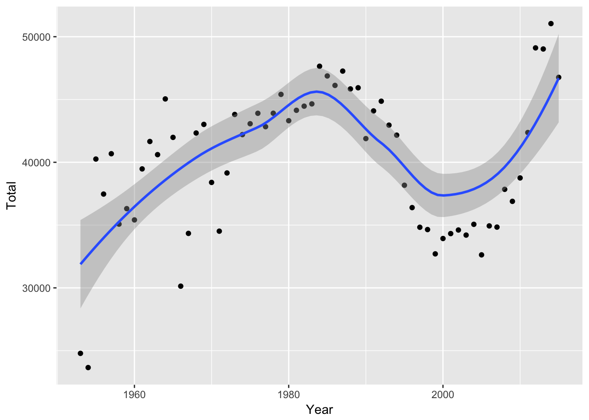
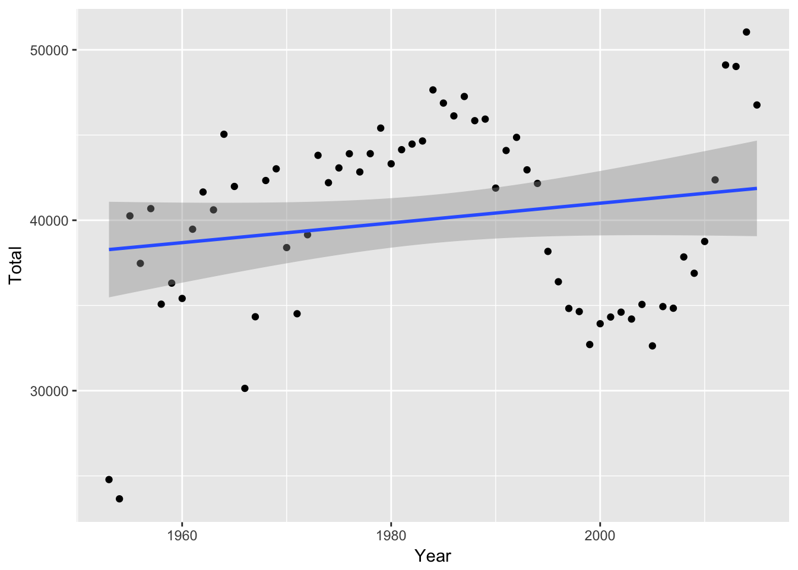
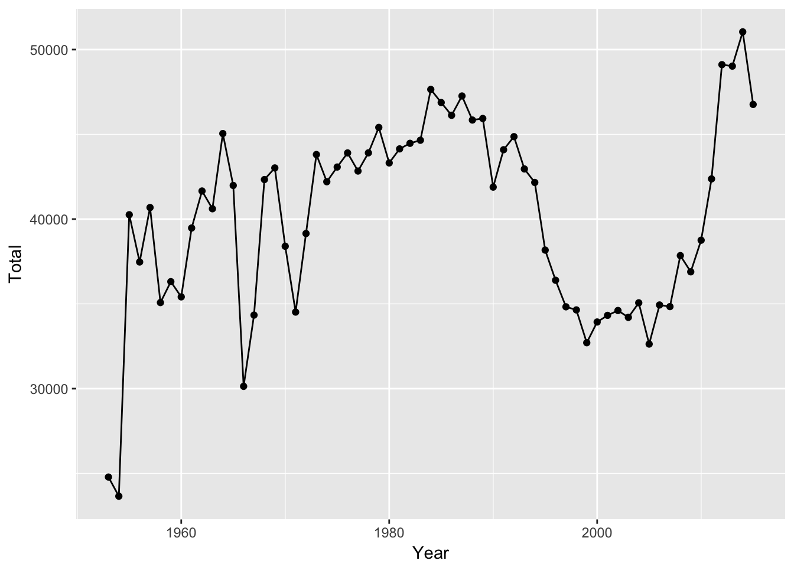
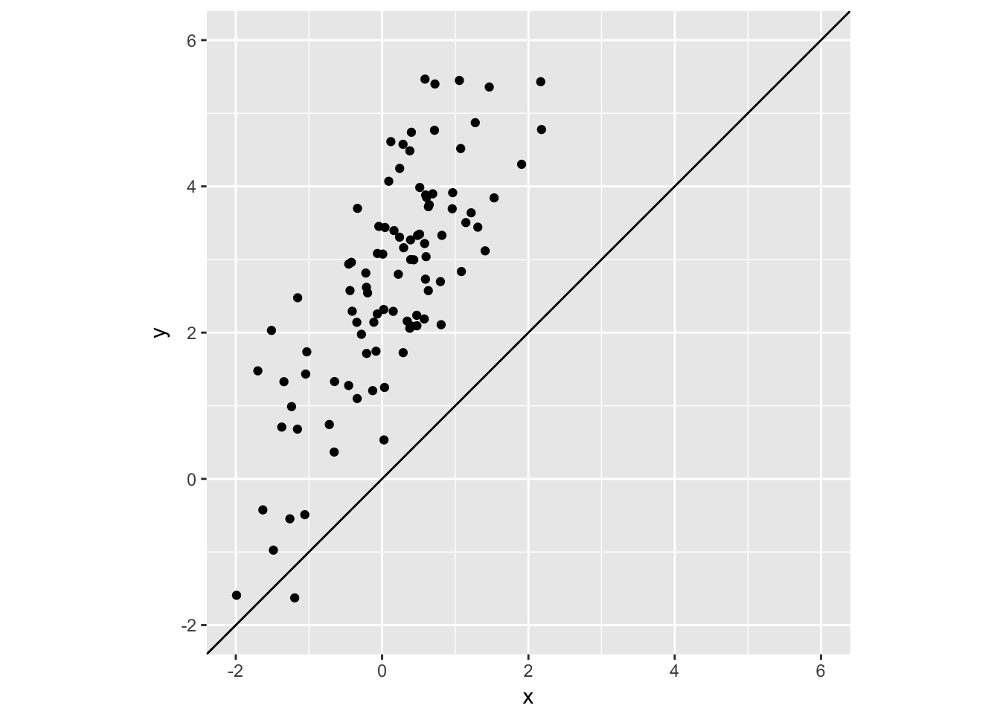
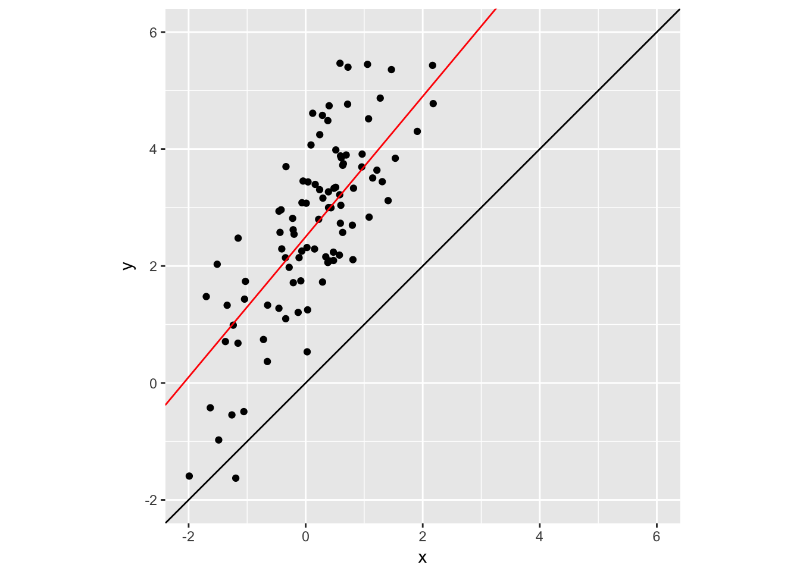
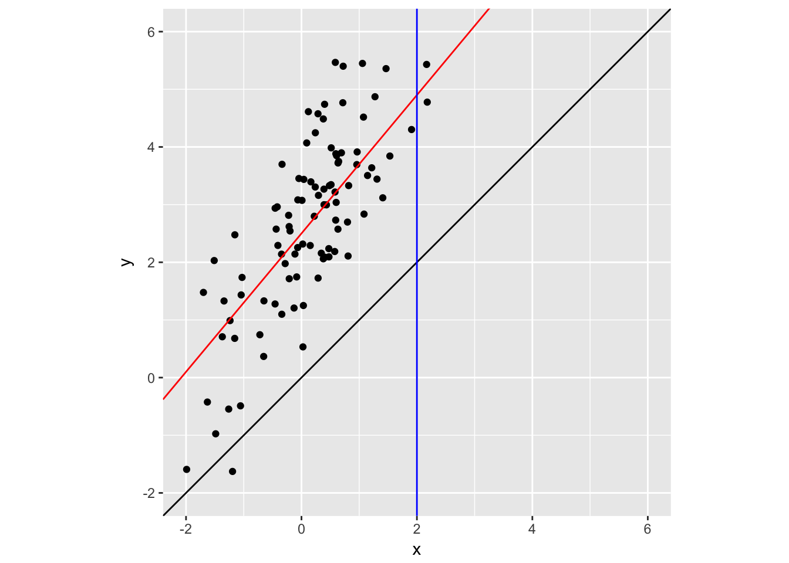
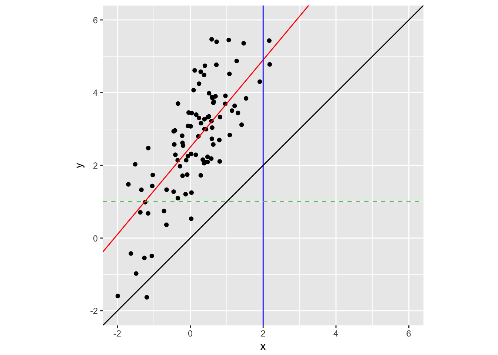

---
output:
  html_document: default
  pdf_document: default
---

# Lines and Curves {#lines}

## Data

We will use data on the number of active duty personnel in Hawaii. 
The first dataset is an Excel file pulled from the State of Hawaii Department of Business, Economic Development, and
Tourism (DBEDT) [2015 State of Hawaii Data Book](http://dbedt.hawaii.gov/economic/databook/2015-individual/). See the line listed
as, "10.03 - Active Duty Personnel, by Service: 1953 to 2015."
The data is originally from the [US Defense Manpower Data Center](www.dmdc.osd.mil/appj/dwp/stats_reports.jsp)


```r
library(tidyverse)
library(readxl)
```


```r
mil_personnel <- read_excel("data/100315.xls", range = "A5:L38", col_types = "numeric")
mil_personnel <- bind_rows(
  mil_personnel %>% select(1:6) %>% magrittr::set_colnames(c("Year", "Total", "Army", "Navy", "Marine Corps", "Air Force")),
  mil_personnel %>% select(7:12) %>% magrittr::set_colnames(c("Year", "Total", "Army", "Navy", "Marine Corps", "Air Force"))
)
mil_personnel
```

```
## # A tibble: 66 x 6
##     Year Total  Army  Navy `Marine Corps` `Air Force`
##    <dbl> <dbl> <dbl> <dbl>          <dbl>       <dbl>
##  1    NA    NA    NA    NA             NA          NA
##  2  1953 24785  5872  7657           6040        5216
##  3  1954 23654  7957  6443           4155        5099
##  4  1955 40258 19821  5211           9677        5549
##  5  1956 37470 16531  5237           9490        6212
##  6  1957 40683 17511  5466           9608        8098
##  7  1958 35076 14672  4908           8670        6826
##  8  1959 36310 15438  5309           8470        7093
##  9  1960 35412 15492  5687           7756        6477
## 10  1961 39474 16945  5774           9679        7076
## # ... with 56 more rows
```

Notice that the `Year` 2015 was turned into `NA`. This happened because the value in the corresponding cell was '2/ 2015'. Let's remove the final row of `NA`s and replace the remaining `NA` with 2015. 


```r
mil_personnel <- mil_personnel %>% filter(!is.na(Total))
mil_personnel[is.na(mil_personnel$Year),]$Year <- 2015
mil_personnel
```

```
## # A tibble: 63 x 6
##     Year Total  Army  Navy `Marine Corps` `Air Force`
##    <dbl> <dbl> <dbl> <dbl>          <dbl>       <dbl>
##  1  1953 24785  5872  7657           6040        5216
##  2  1954 23654  7957  6443           4155        5099
##  3  1955 40258 19821  5211           9677        5549
##  4  1956 37470 16531  5237           9490        6212
##  5  1957 40683 17511  5466           9608        8098
##  6  1958 35076 14672  4908           8670        6826
##  7  1959 36310 15438  5309           8470        7093
##  8  1960 35412 15492  5687           7756        6477
##  9  1961 39474 16945  5774           9679        7076
## 10  1962 41657 17645  6664           9903        7445
## # ... with 53 more rows
```


## geom_smooth

`geom_smooth` allows you to have smooth lines appear in your chart. With no argument, it will
choose `loess` for series shorter than 1,000 observations. It shows a shaded confidence interval.


```r
mil_personnel %>%
  ggplot(aes(Year, Total)) +
  geom_point() +
  geom_smooth()
```



Here's what it looks like if we fit a linear model instead:


```r
mil_personnel %>%
  ggplot(aes(Year, Total)) +
  geom_point() +
  geom_smooth(method = "lm")
```



We can also just have a line chart that connects the points:


```r
mil_personnel %>%
  ggplot(aes(Year, Total)) +
  geom_point() +
  geom_line()
```



## geom_abline

`geom_abline` allows you to display lines with a specific intercept and slope. If no intercept or slope is
provided, a 45-degree line will be shown.


```r
x = rnorm(100)
y = 2.5 + 1.2 * x + rnorm(100)
test_data <- data_frame(x, y)

test_data %>% 
  ggplot(aes(x, y)) +
  geom_point() +
  xlim(-2, 6) + ylim(-2, 6) +
  coord_fixed() +
  geom_abline() 
```




```r
test_data %>% 
  ggplot(aes(x, y)) +
  geom_point() +
  xlim(-2, 6) + ylim(-2, 6) +
  coord_fixed() +
  geom_abline() +
  geom_abline(intercept = 2.5, slope = 1.2, color = "red") 
```



## geom_vline

`geom_vline` allows you to draw vertical lines by specifying an x intercept.


```r
test_data %>% 
  ggplot(aes(x, y)) +
  geom_point() +
  xlim(-2, 6) + ylim(-2, 6) +
  coord_fixed() +
  geom_abline() +
  geom_abline(intercept = 2.5, slope = 1.2, color = "red") +
  geom_vline(xintercept = 2, color = "blue")
```



## hline

`geom_vline` allows you to draw vertical lines by specifying an x intercept.


```r
test_data %>% 
  ggplot(aes(x, y)) +
  geom_point() +
  xlim(-2, 6) + ylim(-2, 6) +
  coord_fixed() +
  geom_abline() +
  geom_abline(intercept = 2.5, slope = 1.2, color = "red") +
  geom_vline(xintercept = 2, color = "blue") +
  geom_hline(yintercept = 1, color = "#4FCC53", lty = 2)
```



## Assignment

Create a visualization of the military data by branch (i.e., `Army`, `Navy`, etc.) using `facet_wrap()`. Plot both the points and a smooth line.

The data we have been working with is not yet [tidy](http://tidyr.tidyverse.org/). Each row contains 
multiple observations (observations for Army, Navy, etc.). To make this tidy we should have one column with 
the personnel counts and one column that indicates the branch.


```r
tidy_mil <- mil_personnel %>%
  gather(branch, personnel, -Year)
tidy_mil
```

```
## # A tibble: 315 x 3
##     Year branch personnel
##    <dbl>  <chr>     <dbl>
##  1  1953  Total     24785
##  2  1954  Total     23654
##  3  1955  Total     40258
##  4  1956  Total     37470
##  5  1957  Total     40683
##  6  1958  Total     35076
##  7  1959  Total     36310
##  8  1960  Total     35412
##  9  1961  Total     39474
## 10  1962  Total     41657
## # ... with 305 more rows
```
