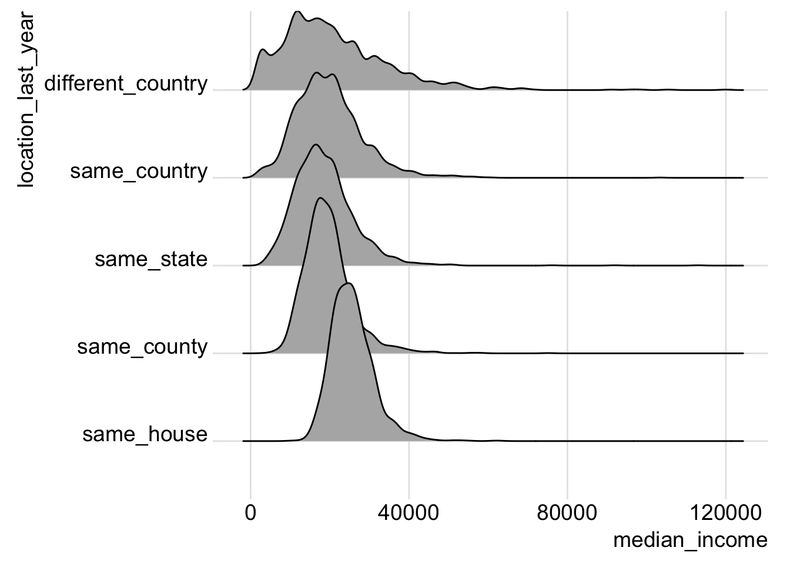

# Scatter Plot Matrices and Extensions {#ggplot-exts}

## Data 

For this section, we'll look at data from the American Community Survey (ACS)
on immigration. To download the data,

1. Go to the [American FactFinder website](https://factfinder.census.gov/).
2. Click on the "Download Center" section, then click the "DOWNLOAD CENTER" button.
3. Click the "NEXT" button, since we know the table we want to download.
4. Select "American Community Survey" from the Program dropdown.
5. Select "2015 ACS 5-year estimates", click the "ADD TO YOUR SELECTIONS" button, then click "NEXT"
6. Select "County - 050" from the geographic type dropdown, then select "All Counties within United States", click the "ADD TO YOUR SELECTIONS" button, then click "NEXT"
7. Type `income mobility` in the "topic or table name"" search box, then select the option that reads: 

"B07011: MEDIAN INCOME IN THE PAST 12 MONTHS (IN 2015 INFLATION-ADJUSTED DOLLARS) BY GEOGRAPHICAL MOBILITY IN THE PAST YEAR FOR CURRENT RESIDENCE IN THE UNITED STATES"

Click "GO", then check the checkbox beside the table we found. Now click on the "Download" button, and 
uncheck the option that says, "Include descriptive data element names." Click "Ok" to create your zip file. Once the file has been created, click "DOWNLOAD" to download the zip file.

The following will assume you moved the following files within the zip to your `data` folder:

* ACS_15_5YR_B07011_with_ann.csv
* ACS_15_5YR_B07011_metadata.csv

The file `ACS_15_5YR_B07011.txt` tells us how to interpret codes within our data. It is possible for median values to be followed by a `+` or `-` if they
are in the upper or lower open-ended interval. In our dataset we don't have any medians in the upper open-ended interval, but we do have entries in the
lower open-ended interval.


```r
library(tidyverse)
```


```r
acs <- read_csv("data/ACS_15_5YR_B07011_with_ann.csv", col_types = strrep("c", 15), na = c("-", "(X)"))
meta <- read_csv("data/ACS_15_5YR_B07011_metadata.csv")
meta
```

```
## # A tibble: 14 x 2
##               GEO.id
##                <chr>
##  1           GEO.id2
##  2 GEO.display-label
##  3         HD01_VD02
##  4         HD02_VD02
##  5         HD01_VD03
##  6         HD02_VD03
##  7         HD01_VD04
##  8         HD02_VD04
##  9         HD01_VD05
## 10         HD02_VD05
## 11         HD01_VD06
## 12         HD02_VD06
## 13         HD01_VD07
## 14         HD02_VD07
## # ... with 1 more variables: Id <chr>
```


Let's keep only the variables we care about, using more informative variable names.

```r
acs_mobility <- acs %>%
  transmute(
    geo = `GEO.display-label`,
    same_house = HD01_VD03,
    same_county = HD01_VD04,
    same_state = HD01_VD05,
    same_country = HD01_VD06,
    different_country = HD01_VD07
  )
acs_mobility
```

```
## # A tibble: 1,949 x 6
##                         geo same_house same_county same_state same_country
##                       <chr>      <chr>       <chr>      <chr>        <chr>
##  1  Autauga County, Alabama      27553       18655      27643        35870
##  2  Barbour County, Alabama      17263       17363       8165        12667
##  3     Bibb County, Alabama      21489       16112       8804         <NA>
##  4   Butler County, Alabama      19499       11734      20769        23887
##  5 Chambers County, Alabama      20708       14522      21218        18516
##  6  Chilton County, Alabama      23668       20646      15739        33464
##  7     Clay County, Alabama      19201       18836      20596        11350
##  8 Cleburne County, Alabama      21888       11583      20380        16475
##  9   Coffee County, Alabama      24325       18957      11906        31702
## 10  Colbert County, Alabama      22419       18389      17330        20093
## # ... with 1,939 more rows, and 1 more variables: different_country <chr>
```

Now we can add an indicator for whether the median value is in the lowest available interval. This would mean that the median value presented has been bottom-coded.

```r
acs_mobility <- acs_mobility %>%
  mutate(
    same_country_bc = grepl("[0-9]*-", same_country),
    different_country_bc = grepl("[0-9]*-", different_country)
  )
acs_mobility
```

```
## # A tibble: 1,949 x 8
##                         geo same_house same_county same_state same_country
##                       <chr>      <chr>       <chr>      <chr>        <chr>
##  1  Autauga County, Alabama      27553       18655      27643        35870
##  2  Barbour County, Alabama      17263       17363       8165        12667
##  3     Bibb County, Alabama      21489       16112       8804         <NA>
##  4   Butler County, Alabama      19499       11734      20769        23887
##  5 Chambers County, Alabama      20708       14522      21218        18516
##  6  Chilton County, Alabama      23668       20646      15739        33464
##  7     Clay County, Alabama      19201       18836      20596        11350
##  8 Cleburne County, Alabama      21888       11583      20380        16475
##  9   Coffee County, Alabama      24325       18957      11906        31702
## 10  Colbert County, Alabama      22419       18389      17330        20093
## # ... with 1,939 more rows, and 3 more variables: different_country <chr>,
## #   same_country_bc <lgl>, different_country_bc <lgl>
```

Let's see how many counties have observations that are bottom coded:

```r
acs_mobility %>%
  summarize(same_country_bc = sum(same_country_bc), different_country_bc = sum(different_country_bc), counties = n())
```

```
## # A tibble: 1 x 3
##   same_country_bc different_country_bc counties
##             <int>                <int>    <int>
## 1              15                   64     1949
```

Let's see what the typical bottom-coded values are:

```r
acs_mobility %>%
  filter(same_country_bc) %>%
  select(same_country) %>%
  table()
```

```
## .
## 2,500- 
##     15
```


```r
acs_mobility %>%
  filter(different_country_bc) %>%
  select(different_country) %>%
  table()
```

```
## .
## 2,500- 
##     64
```

In both cases the bottom-coded interval is the range from zero to 2,500. 
Since this is a small number of counties given the entire range, let's simply
set the bottom-coded values to equal the upper-bound of their interval (i.e., 2,500).

```r
acs_mobility <- acs_mobility %>%
  transmute(
    geo = geo,
    same_house = if_else(grepl("[0-9]*-", same_house), 2500L, as.integer(same_house)),
    same_county = if_else(grepl("[0-9]*-", same_county), 2500L, as.integer(same_county)),
    same_state = if_else(grepl("[0-9]*-", same_state), 2500L, as.integer(same_state)),
    same_country = if_else(same_country_bc, 2500L, as.integer(same_country)),
    different_country = if_else(different_country_bc, 2500L, as.integer(different_country))
  )
acs_mobility
```

```
## # A tibble: 1,949 x 6
##                         geo same_house same_county same_state same_country
##                       <chr>      <int>       <int>      <int>        <int>
##  1  Autauga County, Alabama      27553       18655      27643        35870
##  2  Barbour County, Alabama      17263       17363       8165        12667
##  3     Bibb County, Alabama      21489       16112       8804           NA
##  4   Butler County, Alabama      19499       11734      20769        23887
##  5 Chambers County, Alabama      20708       14522      21218        18516
##  6  Chilton County, Alabama      23668       20646      15739        33464
##  7     Clay County, Alabama      19201       18836      20596        11350
##  8 Cleburne County, Alabama      21888       11583      20380        16475
##  9   Coffee County, Alabama      24325       18957      11906        31702
## 10  Colbert County, Alabama      22419       18389      17330        20093
## # ... with 1,939 more rows, and 1 more variables: different_country <int>
```

Let's rearrange the data into `tidy` format (one observation per row).

```r
tidy_acs <- acs_mobility %>%
  gather(location_last_year, median_income, -geo, factor_key = TRUE)
tidy_acs
```

```
## # A tibble: 9,745 x 3
##                         geo location_last_year median_income
##                       <chr>             <fctr>         <int>
##  1  Autauga County, Alabama         same_house         27553
##  2  Barbour County, Alabama         same_house         17263
##  3     Bibb County, Alabama         same_house         21489
##  4   Butler County, Alabama         same_house         19499
##  5 Chambers County, Alabama         same_house         20708
##  6  Chilton County, Alabama         same_house         23668
##  7     Clay County, Alabama         same_house         19201
##  8 Cleburne County, Alabama         same_house         21888
##  9   Coffee County, Alabama         same_house         24325
## 10  Colbert County, Alabama         same_house         22419
## # ... with 9,735 more rows
```

## ggplot2 extensions

There are many extensions the community have made that build on ggplot2. 
The following link provides a gallery of many of these extensions: 

[ggplot2 extensions](http://www.ggplot2-exts.org/gallery)

Some others that are usefull are `ggjoy` and `GGally`.

## ggjoy

Make sure `ggjoy` is installed.

```
install.packages("ggjoy")
```

`ggjoy` gives us the ability to stack kernel density plots.


```r
ggplot(tidy_acs, aes(x = median_income, y = location_last_year, group(location_last_year))) +
  ggjoy::geom_joy() +
  ggjoy::theme_joy()
```



This plot shows us that, on average, the distance moved in the past year is inversely related to median income.

## scatterplot matrix (GGally::ggscatmat)

Make sure you have `GGally` installed.

```
install.packages("GGally")
```

One particular library, [GGally](http://ggobi.github.io/ggally/), has a great set of visualizations
to extend those that come prebuilt with `ggplot`. One common visualization tool that is missing from
ggplot is the scatterplot matrix. While base R provides `splom()` in the `lattice` library, 
`GGally::ggpairs` and `GGally::ggscatmat` pr ovide an easy tool to create a scatterplot matrix with
ggplot2.


```r
acs_mobility %>%
  as.data.frame() %>%
  GGally::ggscatmat(columns = 2:ncol(.), alpha = 0.1)
```


## Assignment

Go to [American FactFinder](https://factfinder.census.gov/). Follow the steps above up until the point where
we typed out "income mobility". This time pick another keyword to search for and select a different table to
analyze (make sure this will give you more than two columns of data you would like to compare). 
Use `ggscatmat()` to visualize the variables that interest you. Keep the filenames as they are provided by the
Census, so I can run your R Markdown file.
