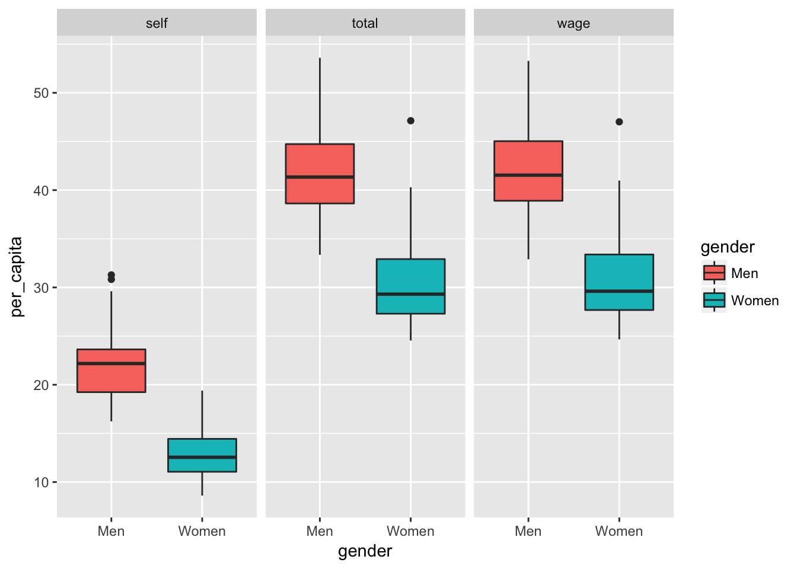
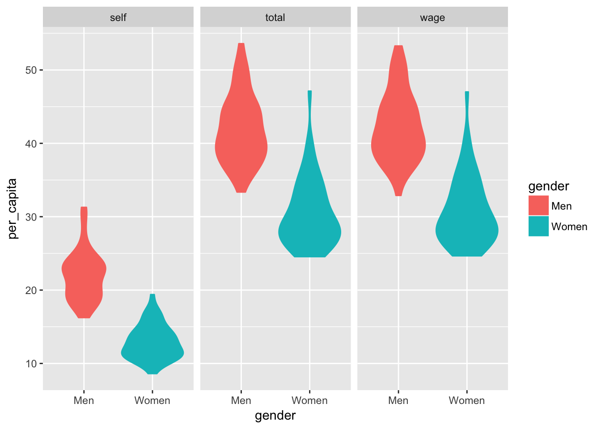

---
output:
  html_document: default
  pdf_document: default
---

# Boxplots and Violin Plots {#boxplots-and-violins}

Boxplots and violin plots are two important tools for visualizing the distribution of
data within a dataset. The boxplot highlights the median, key percentiles, and outliers
within a dataset. The violin plot takes a kernel density plot, rotates it 90 degrees, then
mirrors it about the axis to create a shape that sometimes resembles a violin.

## Data 

The Social Security Administration releases data on earnings and employment
each year. We'll take a look at the data for 2014:

https://www.ssa.gov/policy/docs/statcomps/eedata_sc/2014/index.html

We're going to download Table 1: "Number of persons with Social Security 
(OASDI) taxable earnings, amount taxable, and contributions, by state or 
other area, sex, and type of earnings, 2014"

Save that file as 'ssa_earnings.xlsx' in the `data` folder


```r
library(tidyverse)
library(readxl)
```


```r
ssa <- read_xlsx("data/ssa_earnings.xlsx", range = "A7:J159", 
                 col_names = c("state", "gender", "other", "other2", "number.total", "number.wage", "number.self", 
                               "earnings.total", "earnings.wage", "earnings.self"))
ssa
```

```
## # A tibble: 153 x 10
##       state gender other other2 number.total number.wage number.self
##       <chr>  <chr> <lgl>  <lgl>        <dbl>       <dbl>       <dbl>
##  1  Alabama   <NA>    NA     NA      2355477     2215535      255253
##  2     <NA>    Men    NA     NA      1200468     1116458      138895
##  3     <NA>  Women    NA     NA      1155009     1099077      116357
##  4   Alaska   <NA>    NA     NA       400007      375833       47696
##  5     <NA>    Men    NA     NA       223464      209694       27884
##  6     <NA>  Women    NA     NA       176543      166140       19812
##  7  Arizona   <NA>    NA     NA      3189785     2997567      334292
##  8     <NA>    Men    NA     NA      1660088     1551488      185753
##  9     <NA>  Women    NA     NA      1529697     1446079      148539
## 10 Arkansas   <NA>    NA     NA      1468898     1376249      163320
## # ... with 143 more rows, and 3 more variables: earnings.total <dbl>,
## #   earnings.wage <dbl>, earnings.self <dbl>
```

The starting format is far from ideal. Each row should represent one group,
so we don't need any of the rows with totals.

It's important to always read any footnotes and documentation that comes with
the data you plan to use. Footnote `c` for this table indicates that individuals
with both wage and salary employment will be counted in both groups, but only
once in the total. It is important to be aware of this double counting.


```r
ssa_long <- ssa %>%
  fill(state) %>%
  filter(!is.na(gender)) %>%
  reshape(varying = 5:10, direction = "long", timevar = "earnings_type") %>%
  select(state, gender, earnings_type, number, earnings) %>%
  mutate(per_capita = earnings / number)
```

## Boxplots


```r
ssa_long %>%
  filter(earnings_type != "total") %>%
  ggplot(aes(gender, per_capita)) +
  geom_boxplot()
```


```r
ssa_long %>%
  ggplot(aes(gender, per_capita, fill = gender)) +
  geom_boxplot() +
  facet_grid(~ earnings_type)
```




## Violin Plots

Let's repeat the above plots using the violin plot type.


```r
ssa_long %>%
  filter(earnings_type != "total") %>%
  ggplot(aes(gender, per_capita)) +
  geom_violin()
```


```r
ssa_long %>%
  ggplot(aes(gender, per_capita, color = gender, fill = gender)) +
  geom_violin() +
  facet_grid(~ earnings_type)
```




## Dot Plots

Dot plots appear similar to violin plots, but dot plots may be easier to interpret:


```r
ssa_long %>%
  ggplot(aes(gender, per_capita, color = gender, fill = gender)) +
  geom_dotplot(binaxis = "y", stackdir = "center", position = "dodge") +
  facet_grid(~ earnings_type)
```


## Assignment

Create your own visualizations of the distribution of the `earnings` and `number` variables.

