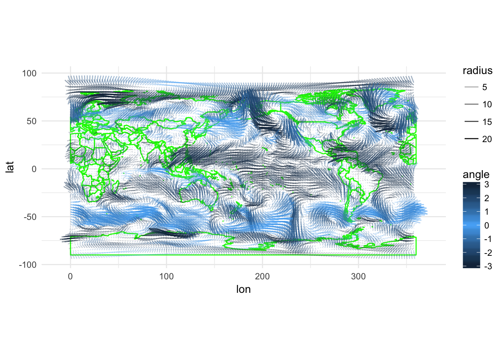
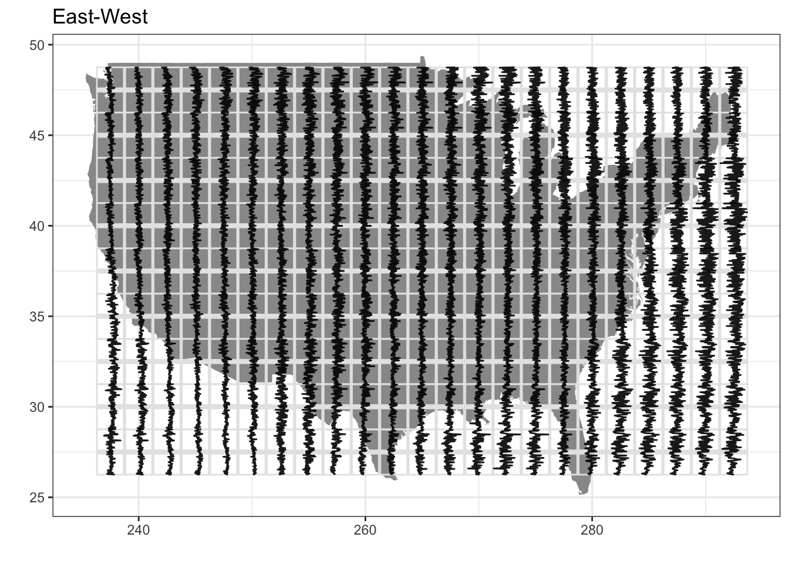

# Spatial Visualizations {#geom_spoke}

## Data

The data for this class will come from the National Oceanic and Atmospheric Administration (NOAA) U.S. Wind Climatology
datasets (https://www.ncdc.noaa.gov/societal-impacts/wind/).

Download the files for both the u-component and the v-component of the wind data. To open these files in R, we'll need
to install the ncdf4 package, which provides an interface to Unidata's netCDF data file format:


```r
install.packages(c("ncdf4", "ncdf4.helpers", "PCICt"))
```

Let's load up the u-component file first:


```r
library(ncdf4)

uwnd_nc <- nc_open("data/uwnd.sig995.2017.nc")
uwnd_nc
```

```
## File data/uwnd.sig995.2017.nc (NC_FORMAT_NETCDF4_CLASSIC):
## 
##      2 variables (excluding dimension variables):
##         float uwnd[lon,lat,time]   
##             long_name: mean Daily u-wind at sigma level 995
##             units: m/s
##             precision: 2
##             least_significant_digit: 1
##             GRIB_id: 33
##             GRIB_name: UGRD
##             var_desc: u-wind
##             dataset: NCEP Reanalysis Daily Averages
##             level_desc: Surface
##             statistic: Mean
##             parent_stat: Individual Obs
##             missing_value: -9.96920996838687e+36
##             valid_range: -102.199996948242
##              valid_range: 102.199996948242
##             actual_range: -26.9250011444092
##              actual_range: 29.8999996185303
##         double time_bnds[nbnds,time]   
## 
##      4 dimensions:
##         lat  Size:73
##             units: degrees_north
##             actual_range: 90
##              actual_range: -90
##             long_name: Latitude
##             standard_name: latitude
##             axis: Y
##         lon  Size:144
##             units: degrees_east
##             long_name: Longitude
##             actual_range: 0
##              actual_range: 357.5
##             standard_name: longitude
##             axis: X
##         time  Size:198   *** is unlimited ***
##             long_name: Time
##             delta_t: 0000-00-01 00:00:00
##             standard_name: time
##             axis: T
##             units: hours since 1800-01-01 00:00:0.0
##             avg_period: 0000-00-01 00:00:00
##             coordinate_defines: start
##             actual_range: 1902192
##              actual_range: 1906920
##         nbnds  Size:2
## 
##     7 global attributes:
##         Conventions: COARDS
##         title: mean daily NMC reanalysis (2014)
##         history: created 2013/12 by Hoop (netCDF2.3)
##         description: Data is from NMC initialized reanalysis
## (4x/day).  These are the 0.9950 sigma level values.
##         platform: Model
##         References: http://www.esrl.noaa.gov/psd/data/gridded/data.ncep.reanalysis.html
##         dataset_title: NCEP-NCAR Reanalysis 1
```

Let's store the uwnd observations in the netCDF file for the u-component:

```r
library(ncdf4.helpers)
library(PCICt)
```

```
## Loading required package: methods
```

```r
uwnd <- ncvar_get(uwnd_nc, "uwnd")
uwnd_time <- nc.get.time.series(uwnd_nc, v = "uwnd", time.dim.name = "time")
uwnd_lon <- ncvar_get(uwnd_nc, "lon")
uwnd_lat <- ncvar_get(uwnd_nc, "lat")
nc_close(uwnd_nc)

library(tidyverse)
```

```
## Loading tidyverse: ggplot2
## Loading tidyverse: tibble
## Loading tidyverse: tidyr
## Loading tidyverse: readr
## Loading tidyverse: purrr
## Loading tidyverse: dplyr
```

```
## Conflicts with tidy packages ----------------------------------------------
```

```
## filter(): dplyr, stats
## lag():    dplyr, stats
```

```r
uwnd_df <- uwnd %>%
  as.data.frame.table(responseName = "uwnd", stringsAsFactors = FALSE) %>%
  rename(a = Var1, b = Var2, c = Var3) %>%
  cbind.data.frame(expand.grid(uwnd_lon, uwnd_lat, uwnd_time)) %>%
  rename(lon = Var1, lat = Var2, time = Var3) %>%
  dplyr::select(lon, lat, time, uwnd)
uwnd_df %>% as.tibble()
```

```
## # A tibble: 2,081,376 x 4
##      lon   lat        time        uwnd
##    <dbl> <dbl> <S3: PCICt>       <dbl>
##  1   0.0    90  2017-01-01 -2.29999971
##  2   2.5    90  2017-01-01 -1.99999964
##  3   5.0    90  2017-01-01 -1.69999957
##  4   7.5    90  2017-01-01 -1.34999967
##  5  10.0    90  2017-01-01 -1.02499962
##  6  12.5    90  2017-01-01 -0.72499961
##  7  15.0    90  2017-01-01 -0.39999962
##  8  17.5    90  2017-01-01 -0.04999962
##  9  20.0    90  2017-01-01  0.27500039
## 10  22.5    90  2017-01-01  0.60000038
## # ... with 2,081,366 more rows
```

Now we need to do the same for the v-component of the wind vectors. Since we know the lat, lon, and time dimensions are repeated, 
we can join directly to the previous data.frame:

```r
vwnd_nc <- nc_open("data/vwnd.sig995.2017.nc")
vwnd <- ncvar_get(vwnd_nc, "vwnd")
vwnd_time <- nc.get.time.series(vwnd_nc, v = "vwnd", time.dim.name = "time")
vwnd_lon <- ncvar_get(vwnd_nc, "lon")
vwnd_lat <- ncvar_get(vwnd_nc, "lat")
nc_close(vwnd_nc)

wind <- vwnd %>%
  as.data.frame.table(responseName = "vwnd", stringsAsFactors = FALSE) %>%
  cbind.data.frame(uwnd_df) %>%
  rename(lon2 = Var1, lat2 = Var2, time2 = Var3) %>%
  select(lon, lat, time, vwnd, uwnd) 
wind %>% as.tibble()
```

```
## # A tibble: 2,081,376 x 5
##      lon   lat        time     vwnd        uwnd
##    <dbl> <dbl> <S3: PCICt>    <dbl>       <dbl>
##  1   0.0    90  2017-01-01 7.150002 -2.29999971
##  2   2.5    90  2017-01-01 7.250002 -1.99999964
##  3   5.0    90  2017-01-01 7.350002 -1.69999957
##  4   7.5    90  2017-01-01 7.375001 -1.34999967
##  5  10.0    90  2017-01-01 7.475002 -1.02499962
##  6  12.5    90  2017-01-01 7.475002 -0.72499961
##  7  15.0    90  2017-01-01 7.525002 -0.39999962
##  8  17.5    90  2017-01-01 7.550002 -0.04999962
##  9  20.0    90  2017-01-01 7.550002  0.27500039
## 10  22.5    90  2017-01-01 7.525002  0.60000038
## # ... with 2,081,366 more rows
```

Otherwise, we would need to merge these data.frames to get `uwnd` and `vwnd` together with the following, which takes long time to run:
```
wind <- merge(uwnd_df, vwnd_df)
```


## geom_spoke

To represent these wind vectors we'll use the `geom_spoke()`. We'll start just plotting wind
patterns for January 1, 2017:

```r
wind <- wind %>%
  mutate(angle = atan2(vwnd, uwnd), radius = sqrt(uwnd^2 + vwnd^2), time = as.POSIXct(time))
wind %>%
  filter(time == as.POSIXct("2017-01-01", tz = "GMT")) %>%
  ggplot(aes(lon, lat)) +
  geom_spoke(aes(angle = angle, radius = radius, alpha = radius, color = angle)) +
  scale_color_gradient2(low = "#132B43", mid = "#56B1F7", high = "#132B43")
```


## maps

```
install.packages("maps")
```

Map data will help to provide some context to this wind figure. We'll use `geom_polygon` to
plot the world centered on the Pacific Ocean (`world2`) using the `map_data()` function.


```r
world <- map_data("world2")
wind %>%
  filter(time == as.POSIXct("2017-01-01", tz = "GMT")) %>%
  ggplot(aes(lon, lat)) +
  geom_polygon(data = world, aes(x=long, y = lat, group = group), color = "green", fill = NA) + 
  coord_fixed(1) +
  geom_spoke(aes(angle = angle, radius = radius, alpha = radius, color = angle)) +
  scale_color_gradient2(low = "#132B43", mid = "#56B1F7", high = "#132B43") +
  theme_minimal()
```




## gganimate

The `gganimate` package lets us animate the above chart.
If you want to be able to save animations as an mp4, you will need install 
`ffmpeg` (https://www.ffmpeg.org/download.html). If you are running macOS, you will
need also need ImageMagick (http://www.imagemagick.org/script/binary-releases.php#macosx).

You can install `gganimate` with `devtools`:
```
devtools::install_github("dgrtwo/gganimate")
```


```r
library(gganimate)
f <- wind %>%
  ggplot(aes(lon, lat)) +
  geom_polygon(data = world, aes(x=long, y = lat, group = group), color = "green", fill = NA) + 
  coord_fixed(1) +
  geom_spoke(aes(angle = angle, radius = radius, alpha = radius, color = angle, frame = time)) +
  scale_color_gradient2(low = "#132B43", mid = "#56B1F7", high = "#132B43") +
  theme_minimal()
gganimate(f)
```

<video width="672"  controls loop><source src="07-geom_spoke_files/figure-html/wind-animation.webm" /></video>

## glyphs

`glyphs` provide another useful way of analyzing spatial data with a time dimesion. This shows
a tiny line charts representing the north-south component of the wind at each longitude/latitude
combination.

```
library(GGally)
wind$day <- as.numeric(julian(wind$time, as.POSIXct("2017-01-01", tz = "GMT")))
wind$day_flip <- -wind$day
vwnd_gly <- glyphs(wind, "lon", "day", "lat", "vwnd", height=2.5)
uwnd_gly <- glyphs(wind, "lon", "day", "lat", "uwnd", height=2.5)

ggplot(vwnd_gly, aes(gx, gy, group = gid)) +
  add_ref_lines(vwnd_gly, color = "grey90") +
  add_ref_boxes(vwnd_gly, color = "grey90") +
  geom_path() +
  theme_bw() +
  labs(x = "", y = "")
```


Let's focus in on just the continental US:


```r
library(GGally)

usa <- map_data("usa")
usa_long_range <- range(usa$long)
usa_lat_range <- range(usa$lat)

usa_wind <- wind %>%
  filter(lon >= (usa_long_range[1] %% 360) & lon <= (usa_long_range[2] %% 360) &
           lat >= usa_lat_range[1] & lat <= usa_lat_range[2])
usa_wind$day <- as.numeric(julian(usa_wind$time, as.POSIXct("2017-01-01", tz = "GMT")))
usa_wind$day_flip <- -usa_wind$day
usa_vwnd_gly <- glyphs(usa_wind, "lon", "day", "lat", "vwnd", height=2.5)
usa_uwnd_gly <- glyphs(usa_wind, "lon", "uwnd", "lat", "day_flip", height=2.5)

ggplot(usa_vwnd_gly, aes(gx, gy, group = gid)) +
  geom_polygon(data = usa, aes(x = long %% 360, y = lat %% 360, group = group), fill = "grey60") +
  add_ref_lines(usa_vwnd_gly, color = "grey90") +
  add_ref_boxes(usa_vwnd_gly, color = "grey90") +
  geom_path(alpha = 0.9) +
  theme_bw() +
  labs(x = "", y = "", title = "North-South")
ggplot(usa_uwnd_gly, aes(gx, gy, group = gid)) +
  geom_polygon(data = usa, aes(x = long %% 360, y = lat %% 360, group = group), fill = "grey60") +
  add_ref_lines(usa_uwnd_gly, color = "grey90") +
  add_ref_boxes(usa_uwnd_gly, color = "grey90") +
  geom_path(alpha = 0.9) +
  theme_bw() +
  labs(x = "", y = "", title = "East-West")
```



## Assignment

Create heatmaps of `uwnd` and `vwnd` values on March 31, 2017. Each heatmap should be 90 degrees longitude by 
90 degrees lattitude. Hint: Use `facet_grid` and create two new variables to help with faceting. The plot
should end up being 5 facets wide by 3 facets tall.
