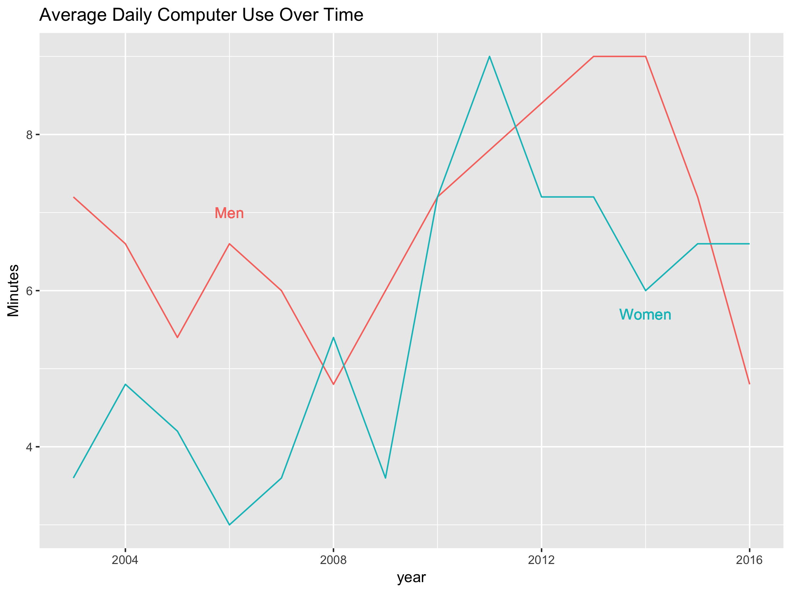

# geom_area and geom_ribbon {#area-and-ribbons}

## Data 

The US Bureau of Labor Statistics (BLS) conducts the American Time Use Survey (ATUS). You can download
the text form of the ATUS by going to the [BLS data page](https://www.bls.gov/data/), finding the
section labelled Spending & Time Use, then clicking on the "Text Files" button on the row for
the ATUS. Or by using the following link:

https://download.bls.gov/pub/time.series/tu/

### Downloading a file from the internet

While you can manually download the files from the above URL, 
`download.file()` lets you download files from within R.
The first argument is the URL of the resource you want to download. 
The second argument is the destination for the file. The following requests will
require you to create the `tu` folder.

```
download.file("https://download.bls.gov/pub/time.series/tu/tu.txt", "data/tu/tu.txt")
download.file("https://download.bls.gov/pub/time.series/tu/tu.series", "data/tu/tu.series")
download.file("https://download.bls.gov/pub/time.series/tu/tu.data.0.Current", "data/tu/tu.data.0.Current")
```
The file `tu.txt` contains the documentation for the time use (tu) survey data. Section 2 of 
that file provides descriptions of each of the files in the `pub/time.series/tu` folder. From that 
list we can see that `tu.series` will give us a list of the available series.


```r
library(readr)
series_defn <- read_tsv("data/tu/tu.series")
series_defn
```

```
## # A tibble: 85,277 x 43
##             series_id seasonal stattype_code datays_code sex_code
##                 <chr>    <chr>         <int>       <chr>    <int>
##  1 TUU10100AA01000007        U         10100          01        0
##  2 TUU10100AA01000013        U         10100          01        0
##  3 TUU10100AA01000014        U         10100          01        0
##  4 TUU10100AA01000015        U         10100          01        0
##  5 TUU10100AA01000018        U         10100          01        0
##  6 TUU10100AA01000019        U         10100          01        0
##  7 TUU10100AA01000025        U         10100          01        0
##  8 TUU10100AA01000035        U         10100          01        0
##  9 TUU10100AA01000036        U         10100          01        0
## 10 TUU10100AA01000037        U         10100          01        0
## # ... with 85,267 more rows, and 38 more variables: region_code <chr>,
## #   lfstat_code <chr>, educ_code <chr>, maritlstat_code <chr>,
## #   age_code <chr>, orig_code <chr>, race_code <chr>, mjcow_code <chr>,
## #   nmet_code <int>, where_code <chr>, sjmj_code <int>,
## #   timeday_code <chr>, actcode_code <chr>, industry_code <chr>,
## #   occ_code <chr>, prhhchild_code <chr>, earn_code <chr>,
## #   disability_code <chr>, who_code <chr>, hhnscc03_code <chr>,
## #   schenr_code <int>, prownhhchild_code <chr>, work_code <int>,
## #   elnum_code <chr>, ecage_code <chr>, elfreq_code <int>,
## #   eldur_code <chr>, elwho_code <chr>, ecytd_code <int>,
## #   elder_code <int>, lfstatw_code <chr>, pertype_code <chr>,
## #   series_title <chr>, footnote_codes <chr>, begin_year <int>,
## #   begin_period <chr>, end_year <int>, end_period <chr>
```

There is a lot here to process. The columns we care most about for now are `series_id` and `series_title`. Using `select()` from the `dplyr` library, we can show just the columns we
care about.


```r
library(dplyr)
series_defn %>%
  select(series_id, series_title)
```

```
## # A tibble: 85,277 x 2
##             series_id
##                 <chr>
##  1 TUU10100AA01000007
##  2 TUU10100AA01000013
##  3 TUU10100AA01000014
##  4 TUU10100AA01000015
##  5 TUU10100AA01000018
##  6 TUU10100AA01000019
##  7 TUU10100AA01000025
##  8 TUU10100AA01000035
##  9 TUU10100AA01000036
## 10 TUU10100AA01000037
## # ... with 85,267 more rows, and 1 more variables: series_title <chr>
```

### Pairing down the list of variables

Let's look for variables on sleep, work, and leisure:


```r
series_defn %>%
  select(series_title) %>%
  filter(grepl("sleep", series_title, ignore.case = TRUE))
```

```
## # A tibble: 1,310 x 1
##                                                                   series_title
##                                                                          <chr>
##  1                                                  Avg hrs per day - Sleeping
##  2                       Avg hrs per day - Sleeping, Weekend days and holidays
##  3                             Avg hrs per day - Sleeping, Nonholiday weekdays
##  4                                        Avg hrs per day - Sleeping, Employed
##  5             Avg hrs per day - Sleeping, Weekend days and holidays, Employed
##  6                   Avg hrs per day - Sleeping, Nonholiday weekdays, Employed
##  7                        Avg hrs per day - Sleeping, Employed, on days worked
##  8 Avg hrs per day - Sleeping, Weekend days and holidays, Employed, on days wo
##  9   Avg hrs per day - Sleeping, Nonholiday weekdays, Employed, on days worked
## 10                              Avg hrs per day - Sleeping, Employed full time
## # ... with 1,300 more rows
```

Since this simple search returns a ton of results, let's further filter by 'employed' and 'per day':

```r
series_defn %>%
  select(series_title) %>%
  filter(grepl("per day.*sleep.*employed", series_title, ignore.case = TRUE))
```

```
## # A tibble: 154 x 1
##                                                                   series_title
##                                                                          <chr>
##  1                                        Avg hrs per day - Sleeping, Employed
##  2             Avg hrs per day - Sleeping, Weekend days and holidays, Employed
##  3                   Avg hrs per day - Sleeping, Nonholiday weekdays, Employed
##  4                        Avg hrs per day - Sleeping, Employed, on days worked
##  5 Avg hrs per day - Sleeping, Weekend days and holidays, Employed, on days wo
##  6   Avg hrs per day - Sleeping, Nonholiday weekdays, Employed, on days worked
##  7                              Avg hrs per day - Sleeping, Employed full time
##  8   Avg hrs per day - Sleeping, Weekend days and holidays, Employed full time
##  9         Avg hrs per day - Sleeping, Nonholiday weekdays, Employed full time
## 10              Avg hrs per day - Sleeping, Employed full time, on days worked
## # ... with 144 more rows
```

Now let's filter further by 'employed full time', 'nonholiday weekdays', and 'on days worked':


```r
series_defn %>%
  select(series_title) %>%
  filter(grepl("per day.*sleep.*nonholiday weekdays.*employed full time.*on days worked", series_title, ignore.case = TRUE))
```

```
## # A tibble: 6 x 1
##                                                                  series_title
##                                                                         <chr>
## 1 Avg hrs per day - Sleeping, Nonholiday weekdays, Employed full time, on day
## 2 Avg hrs per day - Sleeping, Nonholiday weekdays, Employed full time, on day
## 3 Avg hrs per day - Sleeping, Nonholiday weekdays, Employed full time, on day
## 4 Avg hrs per day for participants - Sleeping, Nonholiday weekdays, Employed 
## 5 Avg hrs per day for participants - Sleeping, Nonholiday weekdays, Employed 
## 6 Avg hrs per day for participants - Sleeping, Nonholiday weekdays, Employed
```

Finally, let's filter that to exclude the 'participants only' group and only get the Men/Women
values (not the combined totals):


```r
series_defn %>%
  select(series_title) %>%
  filter(grepl("per day -.*sleep.*nonholiday weekdays.*employed full time.*on days worked,", series_title, ignore.case = TRUE))
```

```
## # A tibble: 2 x 1
##                                                                  series_title
##                                                                         <chr>
## 1 Avg hrs per day - Sleeping, Nonholiday weekdays, Employed full time, on day
## 2 Avg hrs per day - Sleeping, Nonholiday weekdays, Employed full time, on day
```

### Adding more activity categories

Now let's add 'work' and 'leisure' to our search:


```r
activity <- series_defn %>%
  select(series_id, series_title) %>%
  filter(grepl("per day -.*(sleep|work|leisure).*nonholiday weekdays.*employed full time.*on days worked,", series_title, ignore.case = TRUE))
activity
```

```
## # A tibble: 26 x 2
##             series_id
##                 <chr>
##  1 TUU10101AA01000344
##  2 TUU10101AA01000423
##  3 TUU10101AA01000962
##  4 TUU10101AA01001041
##  5 TUU10101AA01003012
##  6 TUU10101AA01003097
##  7 TUU10101AA01003307
##  8 TUU10101AA01003378
##  9 TUU10101AA01003947
## 10 TUU10101AA01004011
## # ... with 16 more rows, and 1 more variables: series_title <chr>
```

Now we should create a variable that codes each of these as either work, sleep, or leisure:


```r
activity <- activity %>%
  mutate(
    activity_type = case_when(
      grepl("leisure", activity$series_title, ignore.case = TRUE) ~ "Leisure",
      grepl("sleep", activity$series_title, ignore.case = TRUE) ~ "Sleep",
      TRUE ~ "Work"
    ), 
    sex = ifelse(grepl("Men", series_title), "Men", "Women")
  )
activity
```

```
## # A tibble: 26 x 4
##             series_id
##                 <chr>
##  1 TUU10101AA01000344
##  2 TUU10101AA01000423
##  3 TUU10101AA01000962
##  4 TUU10101AA01001041
##  5 TUU10101AA01003012
##  6 TUU10101AA01003097
##  7 TUU10101AA01003307
##  8 TUU10101AA01003378
##  9 TUU10101AA01003947
## 10 TUU10101AA01004011
## # ... with 16 more rows, and 3 more variables: series_title <chr>,
## #   activity_type <chr>, sex <chr>
```

Now we can join the activity data.frame with the current data and create time series of
each activity type we created.

```r
data <- read_tsv("data/tu/tu.data.0.Current")
data <- data %>%
  inner_join(activity) %>%
  group_by(year, sex, activity_type) %>%
  summarize(hours = sum(as.numeric(value), na.rm = TRUE))
data
```

```
## # A tibble: 84 x 4
## # Groups:   year, sex [?]
##     year   sex activity_type hours
##    <int> <chr>         <chr> <dbl>
##  1  2003   Men       Leisure  8.49
##  2  2003   Men         Sleep  7.46
##  3  2003   Men          Work 19.26
##  4  2003 Women       Leisure  7.02
##  5  2003 Women         Sleep  7.65
##  6  2003 Women          Work 17.87
##  7  2004   Men       Leisure  8.66
##  8  2004   Men         Sleep  7.49
##  9  2004   Men          Work 18.92
## 10  2004 Women       Leisure  7.34
## # ... with 74 more rows
```


## geom_area

`geom_area` is useful when components that naturally add to each other:


```r
library(ggplot2)
ggplot(data, aes(year, hours, fill= activity_type)) + geom_area() + facet_wrap(~ sex) 
```


## geom_ribbon


```r
data %>%
  ggplot(aes(x = year, group = sex, fill = activity_type)) + 
  geom_ribbon(mapping = aes(ymin = -hours * (sex == "Women"), ymax = hours * (sex == "Men")), data = . %>% filter(activity_type == "Work"), alpha = 0.5) +
  geom_ribbon(mapping = aes(ymin = -hours * (sex == "Women"), ymax = hours * (sex == "Men")), data = . %>% filter(activity_type == "Leisure"), alpha = 0.5) +
  geom_ribbon(mapping = aes(ymin = -hours * (sex == "Women"), ymax = hours * (sex == "Men")), data = . %>% filter(activity_type == "Sleep"), alpha = 0.5) +
  scale_y_continuous(
    name = "Average hours per work day (Fully Employed)",
    breaks = c(-20, -10, 0, 10, 20),
    labels = c("Women 20 hrs", "10 hrs", "0 hrs", "10 hrs", "Men 20 hrs"),
    limits = c(-20, 20)
    )
```


## Assignment

Plot leisure computer use over time using separate lines for men and women. The y axis should display
the amount of use in minutes. The plot should look like the following image (the aspect ratio can be different).



