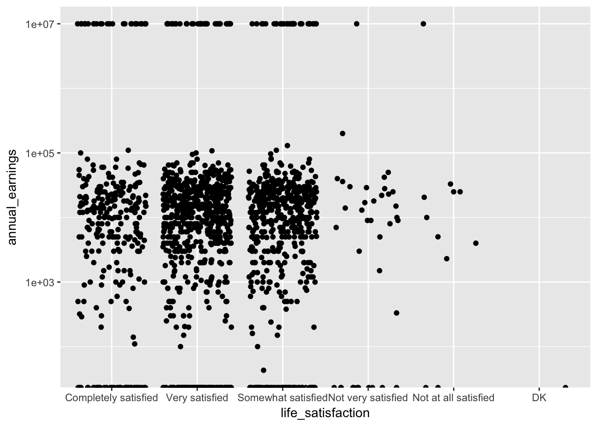
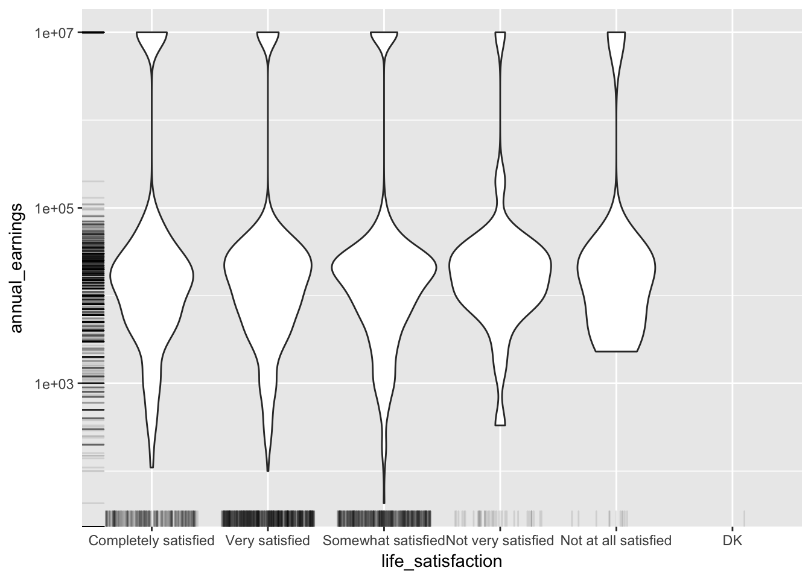
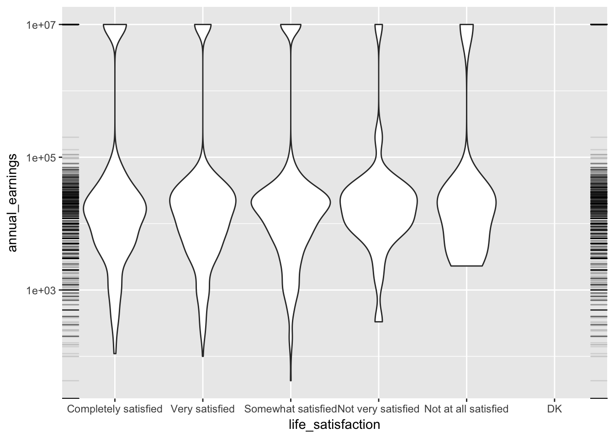
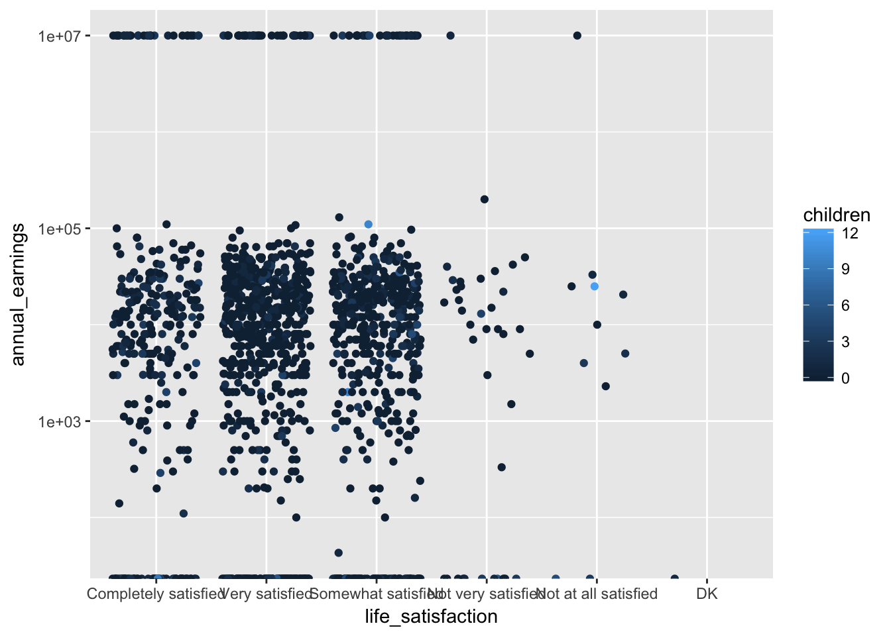
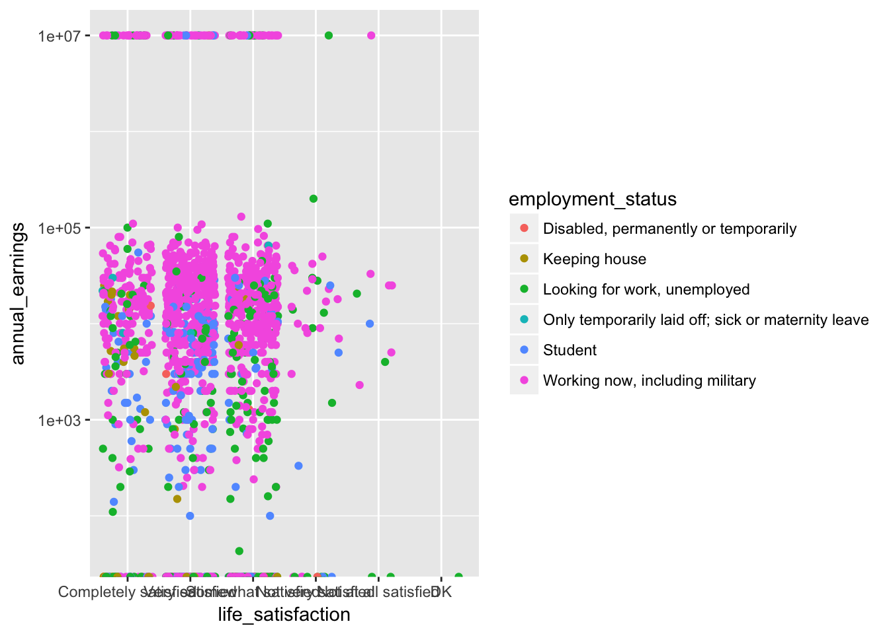
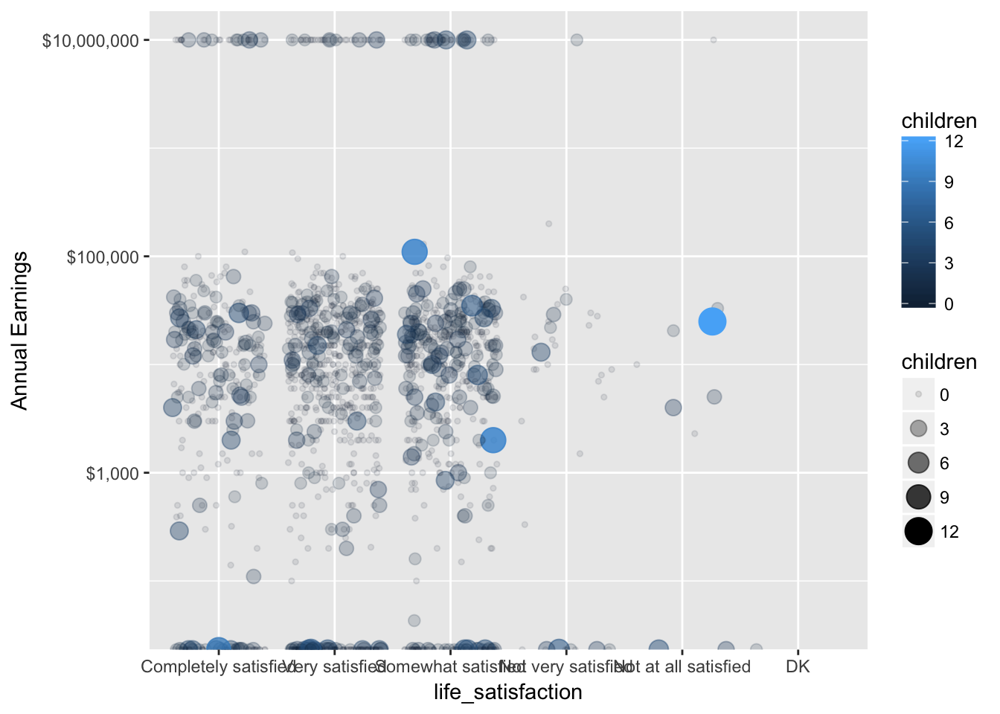

# Jitter, Rug, and Aesthetics {#jitter-rug}

## Data

The [Panel Study of Income Dynamics (PSID)](https://psidonline.isr.umich.edu) is the 
longest running longitudinal household survey in the world.

From the [Data page](https://simba.isr.umich.edu/data/data.aspx), you can use the `Data Center`
to create customized datasets. We'll use the 
[Packaged Data](https://simba.isr.umich.edu/data/PackagedData.aspx) option. Click the 
[Main and Supplemental Studies](https://simba.isr.umich.edu/Zips/ZipMain.aspx) link. Under 
the `Supplemental Studies > Transition into Adulthood Supplement` section, select the download
for `2015`.

To download the supplement you will need to sign in or register for a new account (by clicking the
"New User?" link). Once you have logged in you should be able to download the zip file:

* ta2015.zip

### Codebook

The `TA2015_codebook.pdf` is the perfect place for us to identify some key variables of interest.
The following is an excerpt listing the variables we will use:

```
TA150003  "2015 PSID FAMILY IW (ID) NUMBER"
2015 PSID Family Interview Number

TA150004  "2015 INDIVIDUAL SEQUENCE NUMBER"
2015 PSID Sequence Number
This variable provides a means of identifying an individual's status with regard to the
PSID family unit at the time of the 2015 PSID interview.

Value/Range   Code Value/Range Text
1 - 20        Individuals in the family at the time of the 2015 PSID
              interview
51 - 59       Individuals in institutions at the time of the 2015 PSID
              interview

TA150005 "CURRENT STATE"
Current State (FIPS state codes)

TA150015 "A1_1 HOW SATISFIED W/ LIFE AS A WHOLE"
A1_1. We'd like to start by asking you about life in general. Please think about your
life-as-a-whole. How satisfied are you with it? Are you completely satisfied, very
satisfied, somewhat satisfied, not very satisfied, or not at all satisfied?

Value/Range   Code Value/Range Text
1             Completely satisfied
2             Very satisfied
3             Somewhat satisfied
4             Not very satisfied
5             Not at all satisfied
8             DK

TA150092 "D28A NUMBER OF CHILDREN"
D28a. How many (biological,) adopted, or step-children do you have?

TA150128 "E1 EMPLOYMENT STATUS 1ST MENTION"
E1. Now we have some questions about employment. We would like to know about what you do -
- are you working now, looking for work, keeping house, a student, or what?--1ST MENTION

Value/Range   Code Value/Range Text
1             Working now, including military
2             Only temporarily laid off; sick or maternity leave
3             Looking for work, unemployed
5             Disabled, permanently or temporarily
6             Keeping house
7             Student

TA150512 "F1 HOW MUCH EARN LAST YEAR"
F1. We try to understand how people all over the country are getting along financially, so
now I have some questions about earnings and income. How much did you earn altogether
from work in 2014, that is, before anything was deducted for taxes or other things,
including any income from bonuses, overtime, tips, commissions, military pay or any other
source?

Value/Range     Code Value/Range Text
0 - 5,000,000   Actual amount
    9,999,998   DK
    9,999,999   NA; refused
```

#### FIPS

In preparation for working with these variables, we can setup arrays to take the place
of the codebook. The `tigris` package will give us the FIPS codes for each state:
```
install.packages(tigris)
```

```r
library(tidyverse)

state_fips <- tigris::fips_codes %>%
  group_by(state) %>%
  summarize(fips = as.numeric(first(state_code)))
fips2state <- array()
fips2state[state_fips$fips] <- state_fips$state
fips2state
```

```
##  [1] "AL" "AK" NA   "AZ" "AR" "CA" NA   "CO" "CT" "DE" "DC" "FL" "GA" NA  
## [15] "HI" "ID" "IL" "IN" "IA" "KS" "KY" "LA" "ME" "MD" "MA" "MI" "MN" "MS"
## [29] "MO" "MT" "NE" "NV" "NH" "NJ" "NM" "NY" "NC" "ND" "OH" "OK" "OR" "PA"
## [43] NA   "RI" "SC" "SD" "TN" "TX" "UT" "VT" "VA" NA   "WA" "WV" "WI" "WY"
## [57] NA   NA   NA   "AS" NA   NA   NA   NA   NA   "GU" NA   NA   "MP" NA  
## [71] NA   "PR" NA   "UM" NA   NA   NA   "VI"
```

#### Satisfaction


```r
satisfaction <- array()
satisfaction_levels <- c("Completely satisfied", "Very satisfied", "Somewhat satisfied", "Not very satisfied", "Not at all satisfied", "DK")
satisfaction[c(1, 2, 3, 4, 5, 8)] <- satisfaction_levels
satisfaction
```

```
## [1] "Completely satisfied" "Very satisfied"       "Somewhat satisfied"  
## [4] "Not very satisfied"   "Not at all satisfied" NA                    
## [7] NA                     "DK"
```

#### Employment Status

We can also specify the array elements one by one:

```r
employment <- array()
employment[1] <- "Working now, including military"
employment[2] <- "Only temporarily laid off; sick or maternity leave"
employment[3] <- "Looking for work, unemployed"
employment[5] <- "Disabled, permanently or temporarily"
employment[6] <- "Keeping house"
employment[7] <- "Student"
employment
```

```
## [1] "Working now, including military"                   
## [2] "Only temporarily laid off; sick or maternity leave"
## [3] "Looking for work, unemployed"                      
## [4] NA                                                  
## [5] "Disabled, permanently or temporarily"              
## [6] "Keeping house"                                     
## [7] "Student"
```

### Preprocessing the SPSS File

If you don't have them already, open the zip file and move the `TA2015.txt` and `TA2015.sps` files 
into the `data` folder. For our import to work, We need to find a line that needs to be removed 
from the top of the sps file. The line we want to remove should look like the following line:

```
FILE HANDLE PSID / NAME = '[PATH]\TA2015.TXT' LRECL = 2173 .
```

To find this line we can output the first 20 lines of the `TA2015.sps` file:

```r
readLines("data/TA2015.sps", n = 10)
```

```
##  [1] ""                                                                          
##  [2] "**************************************************************************"
##  [3] "   Label           : Transition to Adulthood Study 2015"                   
##  [4] "   Rows            : 1641"                                                 
##  [5] "   Columns         : 1304"                                                 
##  [6] "   ASCII File Date : July 5, 2017"                                         
##  [7] "*************************************************************************."
##  [8] ""                                                                          
##  [9] "FILE HANDLE PSID / NAME = '[PATH]\\TA2015.TXT' LRECL = 2173 ."             
## [10] "DATA LIST FILE = PSID FIXED /"
```

Now we know the line to remove is line number 9, we can write a new file to be
used in the processing step below.


```r
input <- file("data/TA2015.sps")
output <- file("data/TA2015_clean.sps")

open(input, type = "r")
open(output, open = "w")

writeLines(readLines(input, n = 8), output)
invisible(readLines(input, n = 1))
writeLines(readLines(input), output)

close(input)
close(output)

readLines("data/TA2015_clean.sps", n = 10)
```

```
##  [1] ""                                                                                           
##  [2] "**************************************************************************"                 
##  [3] "   Label           : Transition to Adulthood Study 2015"                                    
##  [4] "   Rows            : 1641"                                                                  
##  [5] "   Columns         : 1304"                                                                  
##  [6] "   ASCII File Date : July 5, 2017"                                                          
##  [7] "*************************************************************************."                 
##  [8] ""                                                                                           
##  [9] "DATA LIST FILE = PSID FIXED /"                                                              
## [10] "      TA150001        1 - 1         TA150002        2 - 6         TA150003        7 - 11   "
```

### Importing with the SPSS file using memisc

The `memisc` package has useful tools for importing SPSS and Stata files that augment what
already exists in `base`. Unfortunately, one of its dependencies, `MASS`, will mask
the select method from `dplyr`. To avoid this, instead of loading `memisc` with 
`library(memisc)`, we can prefix all `memisc` functions with `memisc::`.

```
install.packages("memisc")
```


```r
ta_importer <- memisc::spss.fixed.file("data/TA2015.txt", columns.file = "data/TA2015_clean.sps", varlab.file = "data/TA2015_clean.sps", to.lower = FALSE)
ta_full <- memisc::as.data.set(ta_importer)
ta_full
```

```
## 
## Data set with 1641 observations and 1304 variables
## 
##    TA150001 TA150002 TA150003 TA150004 TA150005 TA150006 TA150007 ...
##  1        1        1     4893        1       37       55        9 ...
##  2        1        2     2967        1       48       57        9 ...
##  3        1        3     6095        5       37       96        9 ...
##  4        1        4     3738        3        8       98        9 ...
##  5        1        5     6741        3       16      104        9 ...
##  6        1        6     4839        1       28       68        9 ...
##  7        1        7     3828        1       48       67        9 ...
##  8        1        8     5640       51       21       88        9 ...
##  9        1        9     5210       52        6       80        9 ...
## 10        1       10      339        3       18       93        9 ...
## 11        1       11     3192        2       26       66        9 ...
## 12        1       12      561        2       26       91        9 ...
## 13        1       13     2500       51       13      100        9 ...
## 14        1       14     5283        2       39       68        9 ...
## 15        1       15     6679        1       24       62        9 ...
## 16        1       16     3286        2        8       67        9 ...
## 17        1       17     3266        2        6      155        9 ...
## 18        1       18     3720        2       48       61        9 ...
## 19        1       19     3714        2       48       82        9 ...
## 20        1       20     6244        1       48       89        9 ...
## 21        1       21     4199        1       13       80        9 ...
## 22        1       22     3962        2       51       86        9 ...
## 23        1       23     2878        1       41       85        9 ...
## 24        1       24     3835        1       37       85        9 ...
## 25        1       25      487       51       13       91        9 ...
## .. ........ ........ ........ ........ ........ ........ ........ ...
## (25 of 1641 observations shown)
```

### Transform Data

Take the arrays we created above to process the file down to the variables we selected.


```r
ta <- ta_full %>%
  as.data.frame() %>%
  as.tbl() %>%
  filter(TA150005 > 0) %>% # get rid of the 1 non-US response
  transmute(
    family_id         = TA150003, 
    in_institution    = TA150004 > 50, 
    state             = fips2state[TA150005], 
    life_satisfaction = factor(satisfaction[TA150015], levels = satisfaction_levels, ordered = TRUE), 
    children          = TA150092, 
    employment_status = employment[TA150128], 
    annual_earnings   = TA150512 %>% na_if(9999999) %>% na_if(9999999)
  )
ta
```

```
## # A tibble: 1,640 x 7
##    family_id in_institution state    life_satisfaction children
##        <dbl>          <lgl> <chr>                <ord>    <dbl>
##  1      4893          FALSE    NC   Somewhat satisfied        0
##  2      2967          FALSE    TX   Somewhat satisfied        0
##  3      6095          FALSE    NC   Somewhat satisfied        0
##  4      3738          FALSE    CO   Somewhat satisfied        0
##  5      6741          FALSE    ID       Very satisfied        0
##  6      4839          FALSE    MS Completely satisfied        1
##  7      3828          FALSE    TX   Somewhat satisfied        0
##  8      5640           TRUE    KY Completely satisfied        0
##  9      5210           TRUE    CA       Very satisfied        0
## 10       339          FALSE    IN   Somewhat satisfied        0
## # ... with 1,630 more rows, and 2 more variables: employment_status <chr>,
## #   annual_earnings <dbl>
```


```r
library(ggplot2)
base_plot <- ggplot(ta, aes(life_satisfaction, annual_earnings)) + scale_y_log10()
base_plot + geom_point()
```


## Jitter

When many points overlap, using `geom_jitter` adjusts the position of each point to minimize overlap.


```r
base_plot + geom_jitter()
```



See how this compares to using `alpha` (i.e., opacity) to see how many points are in a given position:


```r
base_plot + geom_point(alpha = 0.1)
```


## Rug

Often when there are many points, we want to plot a summary that presents the general shape of the data.


```r
base_plot + geom_violin()
```


The `geom_rug` gives us a rug plot that we can use to highlight where actual observations occured when
we create these summary plots.


```r
base_plot + geom_violin() + geom_rug()
```


Both `alpha` and `jitter` can be applied to the rug as well.


```r
base_plot + geom_violin() + geom_rug(alpha = 0.1, position = "jitter")
```



Now we can see that rug did in fact create a line on the x-axis for each observation. We can use the `sides`
property to only display the rug on the left and right (`"lr"`)


```r
base_plot + geom_violin() + geom_rug(alpha = 0.1, position = "jitter", sides = "lr")
```




## Aesthetics
Aesthetics are the visual properties that define each graph. In ggplot, the `aes()` function 
is used to create a mapping from your data to these visual properties. We most often use
`aes()` to map our variables to the `x` and `y` dimension. Above, we used the fact that the
first two arguments to `aes()` are `x` and `y`. That is, 

```
aes(x = life_satisfaction, y = annual_earnings)
```

gives the same result as

```
aes(life_satisfaction, annual_earnings)
```

Anytime we want more than two dimensions of our data displayed, it's useful to map the extra
variables to other features of our graph (e.g., size, color, alpha, etc.). Let's add number of
children to our graph assigning children to color. (In ggplot both American and British 
spellings are supported, so you can use `color` or `colour`.)


```r
ggplot(ta, aes(life_satisfaction, annual_earnings, color = children)) + 
  scale_y_log10() + 
  geom_jitter()
```



If the `children` variable was a factor, more distinct colors would have been chosen. 
We can see this by coloring by `employment_status` instead. 


```r
ggplot(ta, aes(life_satisfaction, annual_earnings, color = employment_status)) + 
  scale_y_log10() + 
  geom_jitter()
```



You can emphasize a variable by encoding in more than one visual aesthetic. Let's map `children` to 
`color`, `size`, and `alpha`.


```r
ggplot(ta, aes(life_satisfaction, annual_earnings, color = children, size = children, alpha = children)) + 
  scale_y_log10("Annual Earnings", labels = scales::dollar) + 
  geom_jitter()
```



## Assignment

Open the codebook (`data/TA2015_codebook.pdf`) and search for two new variables to visualize.  Create a plot that makes use of both jitter and rug.
