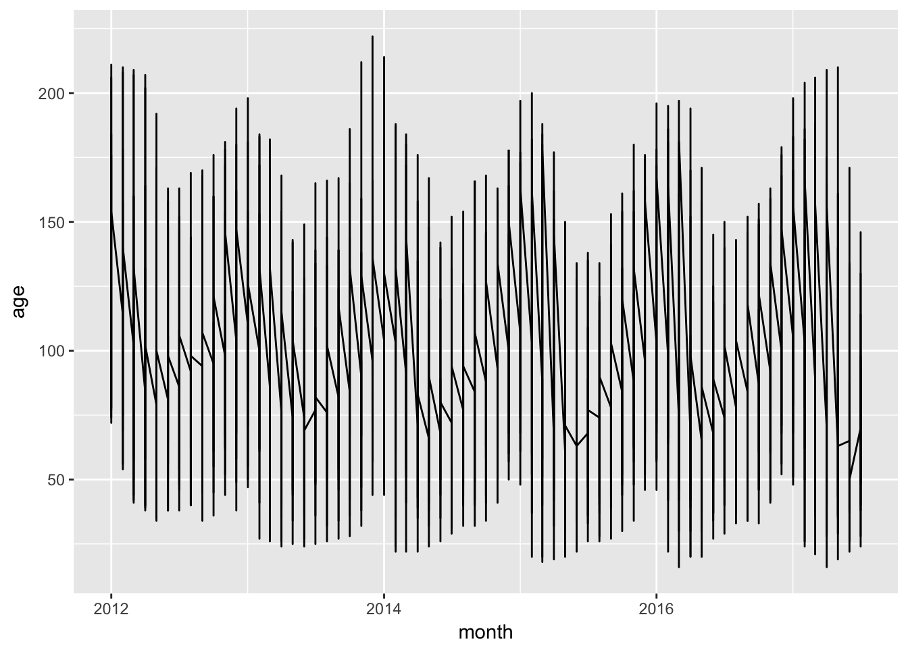
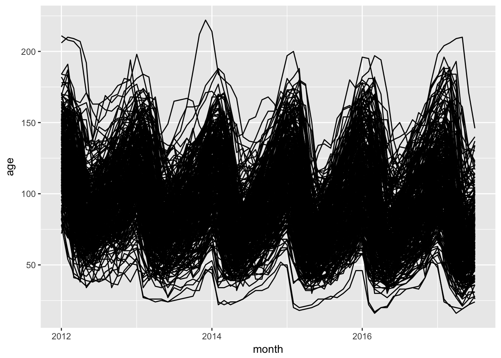
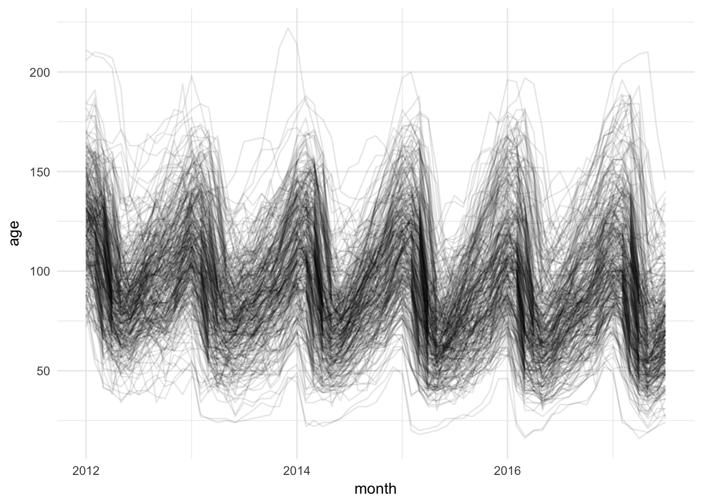
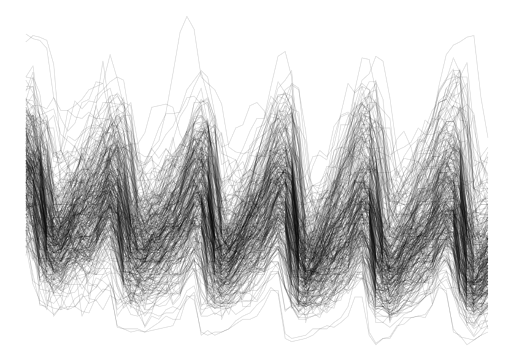
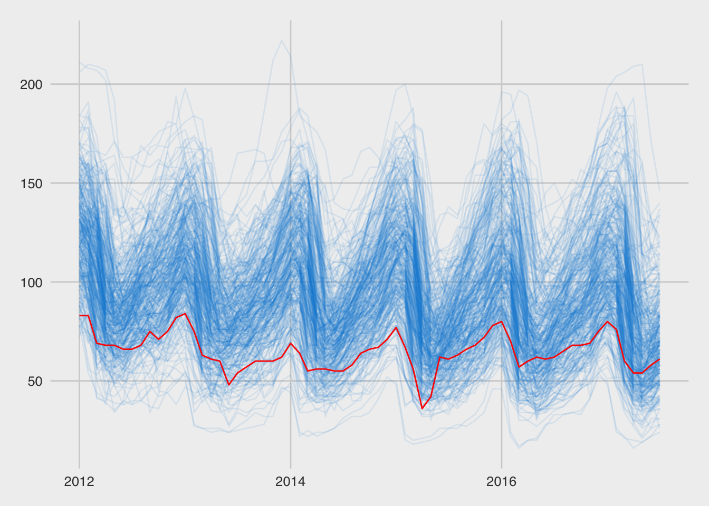
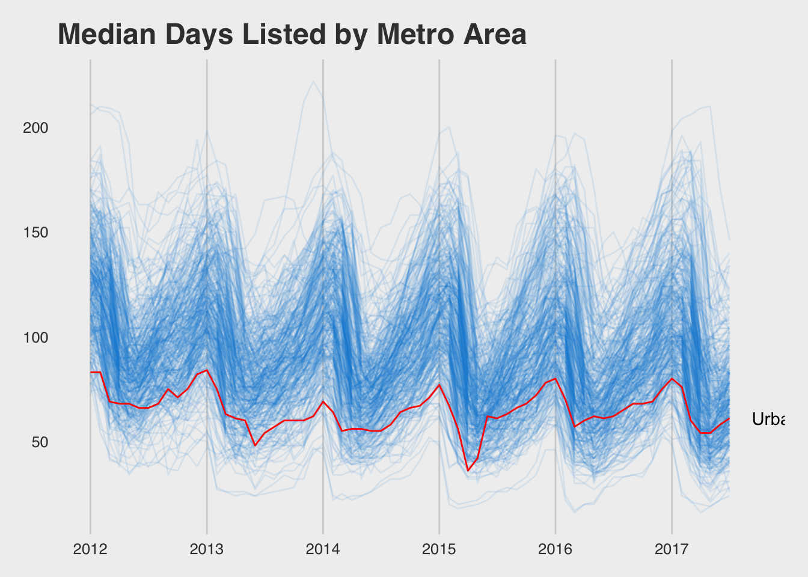
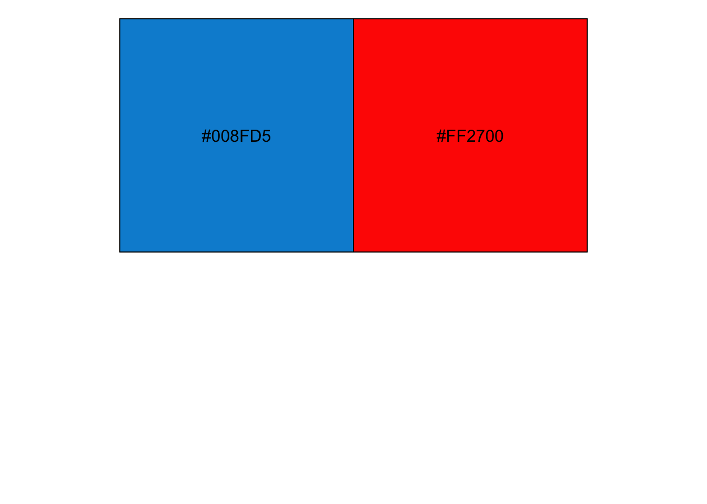
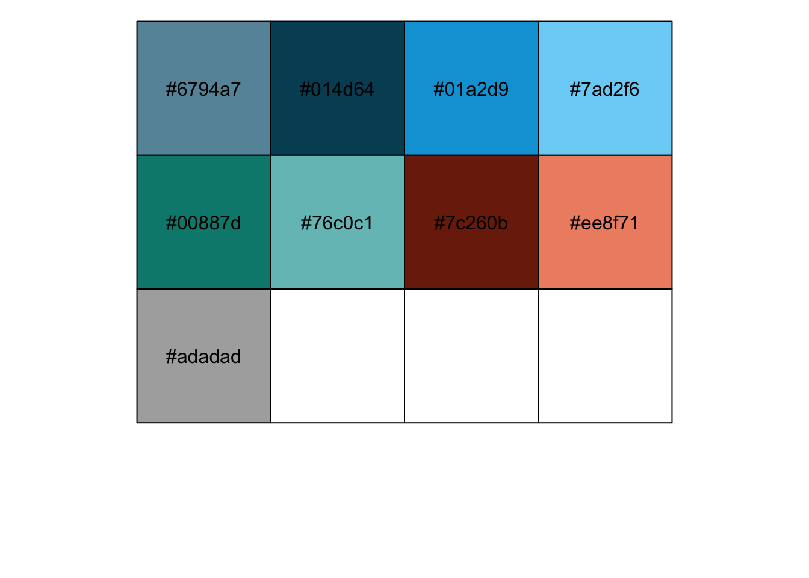
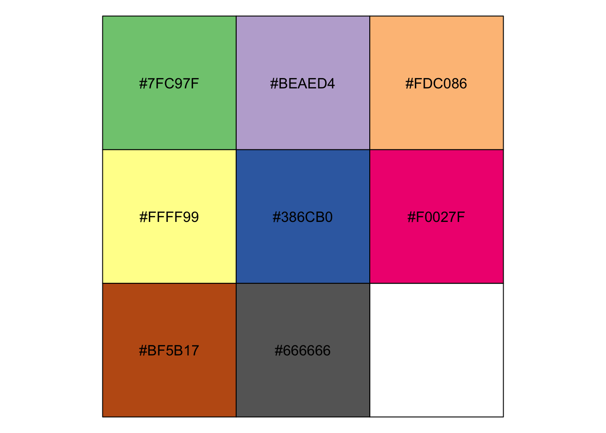
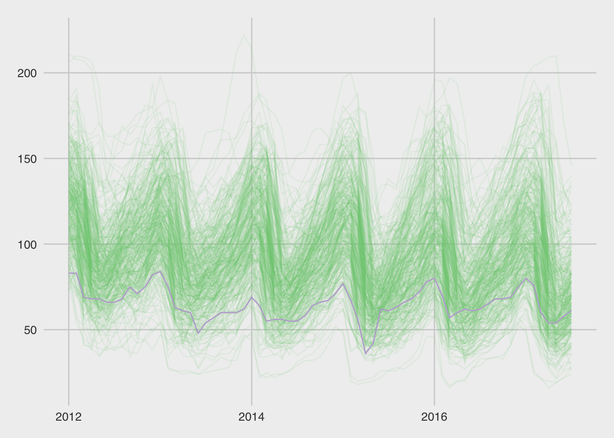

# Themes, Labels, and Colors {#themes-labels-colors}

This lecture uses the following packages:
```
tidyverse
lubridate
ggthemes
grid
gridExtra
```

## Data

### Zillow Real Estate Data

[Zillow](https://www.zillow.com/) is an online marketplace for real estate. 
It facilitates connection between buyers and sellers,
and in the process collects a large amount of useful economic statistics.

From [Zillow's research data page](https://www.zillow.com/research/data/#other-metrics),
we will download the [Age of Inventory (Days)](http://files.zillowstatic.com/research/public/Metro/AgeOfInventory_Metro_Public.csv)
CSV. Their list of data definitions at the bottom of the page includes the following entry:

*Age of Inventory*: Each Wednesday, age of inventory is calculated as the median number of days all active listings as of that Wednesday have been current. These medians are then aggregated into the number reported by taking the median across weekly values.


```r
library(readr)
raw_inventory <- read_csv("data/AgeOfInventory_Metro_Public.csv")
head(raw_inventory)[,1:6]
```

```
## # A tibble: 6 x 6
##              RegionName RegionType StateFullName DataTypeDescription
##                   <chr>      <chr>         <chr>               <chr>
## 1         United States    Country          <NA>           All Homes
## 2          New York, NY        Msa      New York           All Homes
## 3           Chicago, IL        Msa      Illinois           All Homes
## 4 Dallas-Fort Worth, TX        Msa         Texas           All Homes
## 5      Philadelphia, PA        Msa  Pennsylvania           All Homes
## 6           Houston, TX        Msa         Texas           All Homes
## # ... with 2 more variables: `2012-01` <int>, `2012-02` <int>
```

### Reshaping data with `tidyr`

Since this data set uses a separate column for each time period, the data is not yet 
[tidy](https://cran.r-project.org/web/packages/tidyr/vignettes/tidy-data.html). Let's fix that. We'll use
the `gather()` function from the `tidyr` package (http://tidyr.tidyverse.org/reference/gather.html) to identify
the name for the new column that stores the old column names (`month`), the name for the new column that stores
the values in the columns being reshaped (`age`), and a column selector to identify which columns to reshape 
(`matches()` takes a regular expression, see the `regex` documentation). Lastly, we need to `mutate()` the 
`month` using `ymd()` from the `lubridate` package. Into `ymd()`, 
we place the original date character (in "YYYY-MM" format) and add a piece for the day (using the "-DD" format),
so that each of our month time markers are interpreted as the first day of the corresponding month.


```r
library(lubridate)
if("package:dplyr" %in% search()) detach("package:dplyr", unload=TRUE)
library(dplyr)
library(tidyr)
inventory <- raw_inventory %>% select(RegionName, matches("[[:digit:]]")) %>%
  gather(month, age, matches("[[:digit:]]")) %>% 
  mutate(month = ymd(paste0(month, "-01")))
inventory
```

```
## # A tibble: 22,713 x 3
##                   RegionName      month   age
##                        <chr>     <date> <int>
##  1             United States 2012-01-01   120
##  2              New York, NY 2012-01-01   136
##  3               Chicago, IL 2012-01-01   141
##  4     Dallas-Fort Worth, TX 2012-01-01   109
##  5          Philadelphia, PA 2012-01-01   132
##  6               Houston, TX 2012-01-01   112
##  7            Washington, DC 2012-01-01   105
##  8 Miami-Fort Lauderdale, FL 2012-01-01    89
##  9               Atlanta, GA 2012-01-01    98
## 10                Boston, MA 2012-01-01   116
## # ... with 22,703 more rows
```

## Starting Plot

Let's start with a simple line plot of all these series. Let's show what happens if we leave out the
group and color aesthetic.


```r
library(ggplot2)
inventory %>% ggplot(aes(month, age)) + geom_line()
```



Now, let's add in the `group` `aes`.

```r
inventory %>% ggplot(aes(month, age, group = RegionName)) + geom_line()
```



It's hard to see what is happening in this tangled mess. Setting `alpha` to 0.1 will make this
easier to untangle.

```r
basic_plot <- inventory %>% ggplot(aes(month, age, group = RegionName)) + geom_line(alpha = 0.1)
basic_plot
```


Let's emphasize the line for Honolulu.

```r
basic_plot +
  geom_line(data = inventory %>% filter(grepl("Honolulu", RegionName)), aes(month, age), color = "blue")
```


## Themes

### Complete Themes

There are a variety of pre-made themes that can make our figures look cleaner (http://ggplot2.tidyverse.org/reference/ggtheme.html). `theme_bw()` is good if you don't want to print
all the grey from the default, but you still want the same basic structure.


```r
basic_plot + theme_bw()
```


`theme_minimal()` removes some of the visual clutter, removing the plot border and the axis ticks.


```r
basic_plot + theme_minimal()
```



`theme_void()` goes the whole way and removes everything, but the data. It even removes the axis labels.


```r
basic_plot + theme_void()
```



### Modifying a theme

To modify a theme, we just add a call to the `theme()` function and assign new values to the parts of
the plot we want to change (see the `theme()` reference for more examples: http://ggplot2.tidyverse.org/reference/theme.html).

Let's start with the `theme_bw()` and make the chart more minimal.

```r
basic_plot + theme_bw() + theme(
  panel.border = element_blank(),
  panel.grid = element_blank(),
  axis.line = element_line(color = "grey"),
  axis.ticks = element_line(color = "grey"),
  axis.title.y = element_text(angle = 0)
)
```


### `ggthemes`

The `ggthemes` package adds a large set of fun themes. See the vignette at 
https://cran.r-project.org/web/packages/ggthemes/vignettes/ggthemes.html or enter the following command locally
after installing the package

```
install.packages("ggthemes")
vignette("ggthemes", package = "ggthemes")
```

To make our chart look like it came out of the economist, let's use `theme_economist()`. To make the line colors
work, we'll use the `economist_pal()` color pal


```r
library(ggthemes)
theme_colors <- economist_pal()(2)
inventory %>% ggplot(aes(month, age, group = RegionName)) + 
  geom_line(color = theme_colors[1], alpha = 0.1) +
  geom_line(data = inventory %>% filter(grepl("Honolulu", RegionName)), 
            aes(month, age), 
            color = theme_colors[2]) + 
  theme_economist()
```


Now let's try out the theme named for http://fivethirtyeight.com/.


```r
theme_colors <- fivethirtyeight_pal()(2)
five38 <- inventory %>% ggplot(aes(month, age, group = RegionName)) + 
  geom_line(color = theme_colors[1], alpha = 0.1) +
  geom_line(data = inventory %>% filter(grepl("Honolulu", RegionName)), 
            aes(month, age), 
            color = theme_colors[2]) + 
  theme_fivethirtyeight()
five38
```




## Labels

Now that we have a nice looking basic chart, we need to make sure our labels are in the
right places and give enough information.

### Title

Let's start by adding a title. For a time series like this, using the name of the variable on
the x-axis is a good start. We can also change the x-axis to break at each year, which makes
the seasonality of this series even easier to pick out. With these added vertical lines, 
our chart will be more readable if we remove the horizontal gridlines (`panel.grid.major.y`).


```r
five38_with_title <- five38 + 
  ggtitle("Median Days Listed by Metro Area") + 
  scale_x_date(date_breaks = "1 year", date_labels = "%Y") +
  theme(panel.grid.major.y = element_blank())
five38_with_title
```


Since we used our title wisely we don't need to add a y-axis title. The x-axis is time and this is
fairly obvious, so we can also leave off the x-axis title. What we should do is label the highlighted series.


```r
last_hnl <- inventory %>%
  filter(grepl("Honolulu", RegionName)) %>%
  top_n(1, month)
gg <- five38_with_title + 
  geom_text(data = last_hnl, label = last_hnl$RegionName,
            hjust = "left", nudge_x = 70)
gg
```



To adjust the margins, we have to drill deeper than ggplot. I found the following approach through searching
for `ggplot clipping` (https://rud.is/b/2015/08/27/coloring-and-drawing-outside-the-lines-in-ggplot/).


```r
library(gridExtra)
library(grid)
gb <- ggplot_build(gg + theme(plot.margin = unit(c(1, 7, 2, 1), "lines")))
gt <- ggplot_gtable(gb)

gt$layout$clip[gt$layout$name=="panel"] <- "off"

grid.draw(gt)
```


## Colors

Color is an important tool in creating engaging and informative visualizations. Color is often used to encode
a dimension not already displayed in a chart (e.g., adding a third dimension to a scatter plot). Above, we used
color to highlight a specific set of data points. We used a highlight color for Urban Honolulu and set the other
metro areas to a blue with transparency.

### Color Scales

An easy way to see the colors within a given color scheme is by using the `show_col()` function in
the `scales` package. We can use it to show the colors in the `theme_colors` variable we created above.


```r
library(scales)
show_col(theme_colors)
```



The combinations of letters and numbers in the color squares is the hex representation of the 
red, green, and blue color values that make up the given color (e.g., `#008FD5`). Adobe has a fun
color chooser where you can paste these hex values and create your own color scheme:

https://color.adobe.com/


There are not many colors in the `fivethirtyeight_pal()` color palette (only 3). The `economist_pal()` palette has 11, which is a bit better for categorical data:


```r
show_col(economist_pal()(11))
```



### Color Brewer

Color Brewer (http://colorbrewer2.org/) is the gold standard for color choice in maps. The online tool
allows you to preview and export color schemes that are designed for accessibility (i.e., color-blind safe)
and for the main strategies for encoding data using color (sequential, diverging, and qualitative). Most
of these scales are available within ggplot (http://ggplot2.tidyverse.org/reference/scale_brewer.html).


```r
RColorBrewer::brewer.pal.info
```

```
##          maxcolors category colorblind
## BrBG            11      div       TRUE
## PiYG            11      div       TRUE
## PRGn            11      div       TRUE
## PuOr            11      div       TRUE
## RdBu            11      div       TRUE
## RdGy            11      div      FALSE
## RdYlBu          11      div       TRUE
## RdYlGn          11      div      FALSE
## Spectral        11      div      FALSE
## Accent           8     qual      FALSE
## Dark2            8     qual       TRUE
## Paired          12     qual       TRUE
## Pastel1          9     qual      FALSE
## Pastel2          8     qual      FALSE
## Set1             9     qual      FALSE
## Set2             8     qual       TRUE
## Set3            12     qual      FALSE
## Blues            9      seq       TRUE
## BuGn             9      seq       TRUE
## BuPu             9      seq       TRUE
## GnBu             9      seq       TRUE
## Greens           9      seq       TRUE
## Greys            9      seq       TRUE
## Oranges          9      seq       TRUE
## OrRd             9      seq       TRUE
## PuBu             9      seq       TRUE
## PuBuGn           9      seq       TRUE
## PuRd             9      seq       TRUE
## Purples          9      seq       TRUE
## RdPu             9      seq       TRUE
## Reds             9      seq       TRUE
## YlGn             9      seq       TRUE
## YlGnBu           9      seq       TRUE
## YlOrBr           9      seq       TRUE
## YlOrRd           9      seq       TRUE
```


```r
show_col(brewer_pal(palette = "Accent")(8))
```



Here's how to take this color palette and apply it to our previous chart:


```r
theme_colors <- brewer_pal(palette = "Accent")(8)
inventory %>% ggplot(aes(month, age, group = RegionName)) + 
  geom_line(color = theme_colors[1], alpha = 0.1) +
  geom_line(data = inventory %>% filter(grepl("Honolulu", RegionName)), 
            aes(month, age), 
            color = theme_colors[2]) + 
  theme_fivethirtyeight()
```



## Assignment

Using the same file, pick a different time series to emphasize (with a different color) 
and choose a different theme.
