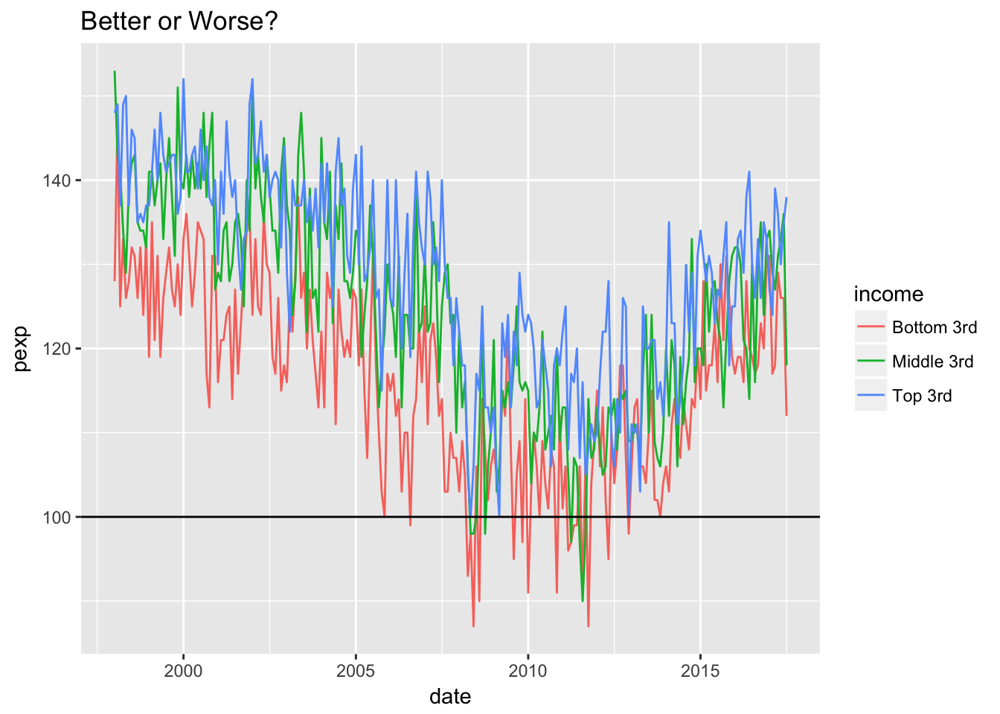
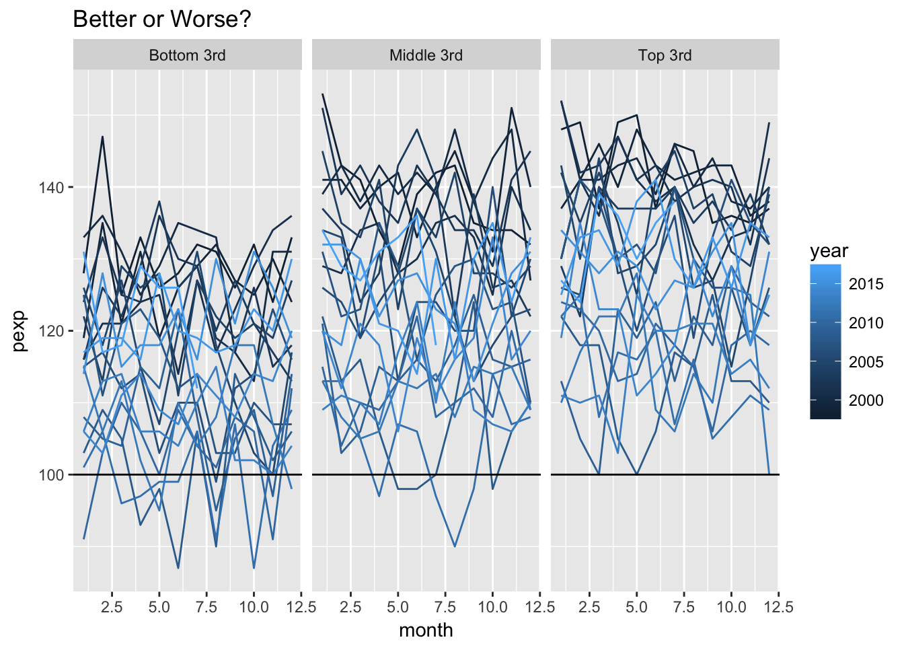
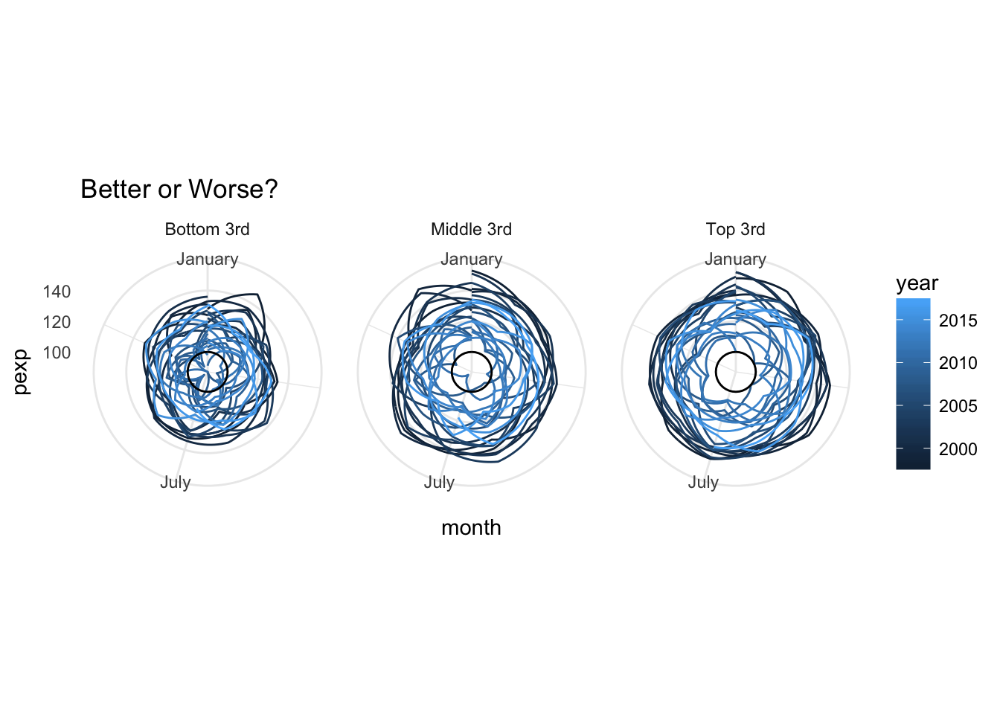

# Polar Coordinates {#polar}

This lecture uses the following packages:
```
tidyverse
lubridate
forcats
```

## Data

### Survey of Consumers {-}

The University of Michigan conducts the Survey of Consumers. This monthly survey takes the pulse of
consumers to help predict the state of the economy in the near future. We will be using a few responses
from this monthly survey to highlight how you can visualize periodic data. For full definitions of the
variables we will work with take a look at the online codebook: https://data.sca.isr.umich.edu/subset/codebook.php

To download the data

1. Go to the Survey of Consumers' data page: https://data.sca.isr.umich.edu/subset/subset.php
2. In the **Frequency and Range** section, set the **Starting year** to 1998, since that is the first year with complete data on "Probability of Losing a Job During the Next 5 Years" (PJOB)
3. In the **Demographics** section, check all Income groups (y13 = *Bottom 33%*, y23 = *Middle 33%*, and y33 = *Top 33%*)
4. In the **Variables** section, check *PEXP* and *PJOB* in the **Personal Finances** subsection, and check *UMEX* in the **Unemployment, Interest Rates, Prices, Government Expectations** subsection
5. Click on the "Download CSV" button.

Load the downloaded dataset.


```r
library(tidyverse)
survey <- read_csv("data/scaum-814.csv")
```

Divide the date column into year and month columns.

```r
library(lubridate)
survey <- survey %>%
  mutate(date = parse_date(yyyymm, format = "%Y%m"),
         year = year(date),
         month = month(date)
  ) %>%
  select(-yyyymm)
survey
```

```
## # A tibble: 235 x 12
##    pexp_r_y13 pexp_r_y23 pexp_r_y33 pjob_mean_y13 pjob_mean_y23
##         <int>      <int>      <int>         <dbl>         <dbl>
##  1        128        153        148          15.3          16.6
##  2        147        143        149          18.9          19.8
##  3        125        141        137          14.4          16.4
##  4        133        134        149          14.2          18.5
##  5        126        129        150          15.8          16.8
##  6        128        139        137          14.4          14.8
##  7        132        142        146          17.0          18.6
##  8        131        143        145          15.8          19.3
##  9        126        135        135          18.1          17.2
## 10        132        134        136          19.4          16.6
## # ... with 225 more rows, and 7 more variables: pjob_mean_y33 <dbl>,
## #   umex_r_y13 <int>, umex_r_y23 <int>, umex_r_y33 <int>, date <date>,
## #   year <dbl>, month <dbl>
```

Each variable is calculated from the survey as follows:

Code  | Survey Question     | Calculation
------|---------------------|---------------
PEXP  | "Now looking ahead -- do you think that a year from now you (and your family living there) will be better off financially, worse off, or just about the same as now?" | Better - Worse + 100
PJOB  | "During the next 5 years, what do you think the chances are that you (or your husband/wife) will lose a job you wanted to keep?" | Mean
UMEX  | "How about people out of work during the coming 12 months ‐‐ do you think that there will be more unemployment than now, about the same, or less?" | Less - More + 100

To make our dataset tidy, we want each variable to have it's own row. Since we added the income demographic option,
we have multiple columns for each variable. Let's fix that with the `gather()` -> `separate()` -> `spread()` pattern.


```r
library(forcats)
survey <- survey %>%
  gather(key = "key", value = "value", -year, -month, -date) %>%
  separate(key, into = c("variable", "type", "income")) %>%
  select(-type) %>%
  spread(key = "variable", value = "value") %>%
  mutate(income = fct_recode(as_factor(income), `Bottom 3rd` = "y13", `Middle 3rd` = "y23", `Top 3rd` = "y33"))
survey
```

```
## # A tibble: 705 x 7
##          date  year month     income  pexp  pjob  umex
##        <date> <dbl> <dbl>     <fctr> <dbl> <dbl> <dbl>
##  1 1998-01-01  1998     1 Bottom 3rd   128  15.3    90
##  2 1998-01-01  1998     1 Middle 3rd   153  16.6    94
##  3 1998-01-01  1998     1    Top 3rd   148  15.8    99
##  4 1998-02-01  1998     2 Bottom 3rd   147  18.9   103
##  5 1998-02-01  1998     2 Middle 3rd   143  19.8   103
##  6 1998-02-01  1998     2    Top 3rd   149  14.7   100
##  7 1998-03-01  1998     3 Bottom 3rd   125  14.4    90
##  8 1998-03-01  1998     3 Middle 3rd   141  16.4   106
##  9 1998-03-01  1998     3    Top 3rd   137  17.8   104
## 10 1998-04-01  1998     4 Bottom 3rd   133  14.2   101
## # ... with 695 more rows
```

## Simple Time Series


```r
ggplot(survey, aes(date, pexp, color = income)) + 
  geom_line() + 
  geom_hline(yintercept = 100) +
  ggtitle("Better or Worse?")
```



## Stacked Periods


```r
better <- ggplot(survey, aes(month, pexp, group = year, color = year)) +
  geom_line() + 
  facet_wrap(~ income) +
  geom_hline(yintercept = 100) +
  ggtitle("Better or Worse?")
better
```



## Polar Coordinates


```r
better + 
  coord_polar(theta = "x") + 
  scale_x_continuous(breaks = c(1, 7), labels = month.name[c(1, 7)]) +
  theme_minimal()
```




## Assignment

Plot the other two variables (`pjob` and `umex`) in polar coordinates giving each plot a title that helps
communicate the meaning of their respective variable.

## Data Attribution

>  Source: Survey of Consumer Expectations, © 2013-2017 Federal Reserve Bank of New York (FRBNY). The SCE data are available without charge at /microeconomics/sce and may be used subject to license terms posted below. FRBNY disclaims any responsibility or legal liability for this analysis and interpretation of Survey of Consumer Expectations data.

